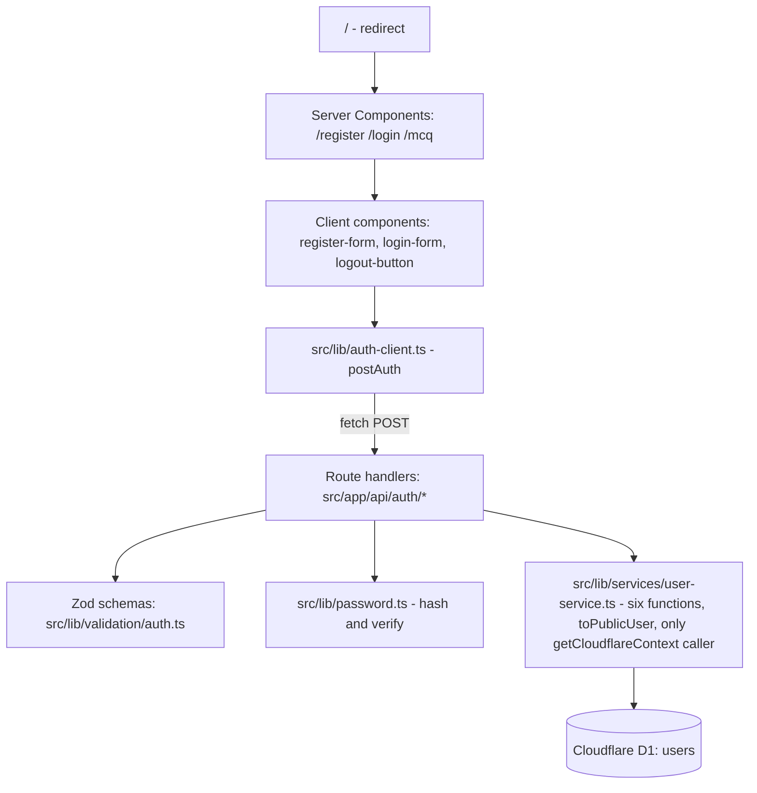

Date created: August 23, 2026
Date last modified: August 23, 2026 (revision 4 - all three Open Decisions approved)

# Register, Login, Logout - Technical PRD

**Sprint**: 1
**Owner**: Kusuma
**Branch**: `feature/register-login-logout` (cut from `main`)
**Status**: PLANNING - Open Decisions approved, awaiting "go Phase 1"

This document is the source of truth for Sprint 1. Application code follows the phases
below and nothing else. If this document and a chat request disagree, stop and ask.

---

## Open Decisions

**All three approved by Kusuma on August 23, 2026.** `AGENTS.md` requires asking before adding
any dependency, and all three decisions add or avoid one, so each is recorded here with the
reasoning that was on the table when it was decided. Do not treat an approved decision as
reopenable without saying so: if one turns out to be wrong during implementation, raise it and
update this section rather than quietly doing something else.

### OD1. Vitest package list (needed by Phase 1, fully exercised in Phase 4)

**Status**: APPROVED - August 23, 2026. Full six-package install, plus `vitest.config.ts` and
the two test scripts.

**The approved command**, run once at the start of Phase 1:

```bash
npm install -D vitest @vitejs/plugin-react @testing-library/react @testing-library/user-event jsdom vite-tsconfig-paths
```

| Package | Why it is needed |
|---|---|
| `vitest` | The test runner itself. |
| `vite-tsconfig-paths` | Makes the `@/` alias resolve in tests. Without it every `import "@/lib/..."` in a test fails. Not optional. |
| `jsdom` | DOM environment for component tests. |
| `@vitejs/plugin-react` | Compiles JSX/TSX for the test run. |
| `@testing-library/react` | Renders client components and queries them the way a user sees them. |
| `@testing-library/user-event` | Drives input the way a user would. The skill prefers it over `fireEvent`. |

**Why six and not five**: `.cursor/skills/testing/SKILL.md` lists five packages in its install
command, but its own React example imports `@testing-library/user-event` and its guidance says
to prefer `userEvent` over `fireEvent`. The sixth package closes that gap in the skill. This
was the one deviation from the skill's literal instruction, and it is the approved list.

**Also created in Phase 1**: `vitest.config.ts` at the repo root exactly as the skill specifies
(`environment: "jsdom"`, `globals: true`, both plugins), and the `test` and `test:watch`
scripts in `package.json`.

**Note on timing**: the harness is part of Phase 1, because every phase is test-first and
none of them can be without a runner. Phase 1's own migration test is the first thing that
needs it. The Testing Library and jsdom half sits unused until Phase 4's component tests.
This is one approval and one install, at the very start.

**Explicitly not proposed**: `@cloudflare/vitest-pool-workers`. The testing skill says it
changes how the whole suite runs and must be raised separately. Sprint 1 mocks the D1
boundary instead.

### OD2. Zod for input validation (needed by Phase 3)

**Status**: APPROVED - August 23, 2026. `zod` is added as a production dependency in Phase 3.

Reasoning that supported it, in order of weight:

1. `.cursor/rules/nextjs.mdc` states: "Validate all Server Action and route handler input
   with a Zod schema before use. Treat every input as untrusted."
2. `.cursor/BUGBOT.md` will flag the PR at review time: "Flag handlers that read
   `await req.json()` and use the result unvalidated."
3. `.cursor/rules/shadcn.mdc` says to build forms as Server Actions validated with Zod and
   surface errors through `FieldError`, which is the exact shape this sprint's two forms
   need.

Three files in this repo independently point at Zod, so hand-rolled validation would have been
working against the project's own guardrails.

**Alternative rejected**: hand-written validation functions, zero dependencies. Rejected
because it contradicts the rules above and because error shaping would be rebuilt by hand.

### OD3. Password hashing: Web Crypto PBKDF2-SHA256 vs bcryptjs (needed by Phase 4)

**Status**: APPROVED - August 23, 2026. Web Crypto PBKDF2-SHA256 via `crypto.subtle`, with the
parameters and single-column storage format below. No dependency added, and **bcryptjs is not
being installed**.

| Consideration | Web Crypto PBKDF2 | bcryptjs |
|---|---|---|
| Dependency cost | None. `crypto.subtle` is in the Workers runtime. | One production dependency, and `AGENTS.md` calls an unexplained dependency a cost in this teaching repo. |
| Workers fit | Native implementation, runs outside the JS event loop. | Pure JavaScript, CPU-bound in the isolate, competing directly with the Worker CPU budget. |
| Correctness risk | Standard, well-specified KDF. | Silently truncates passwords beyond 72 bytes, which surprises people. |
| Tunability | Iteration count is an explicit parameter we choose and document. | Cost factor, same idea, but slower to compute for the same security in pure JS. |
| Teaching value | Shows what a KDF actually is: salt, iterations, derived bits. | Hides it behind one function call. |

The counterpoint that was weighed and accepted anyway: bcrypt is the more conventional choice
in the wider ecosystem, and it ships the encode-and-parse logic that the storage format below
leaves us to write. PBKDF2 with a low iteration count is also genuinely weaker than bcrypt,
which is why the approved parameters are part of the decision rather than an implementation
detail.

**Approved parameters**:

- Algorithm: PBKDF2, SHA-256
- Iterations: 100,000
- Salt: 16 random bytes from `crypto.getRandomValues()`, unique per user
- Derived key length: 256 bits
- Storage: one column, `password_hash`, holding a self-describing string

**Storage format** - salt embedded, single column, in the shape bcrypt and the PHC string
format both use:

```
pbkdf2-sha256$100000$<salt-base64>$<key-base64>
```

Example: `pbkdf2-sha256$100000$c2FsdHNhbHRzYWx0c2Fs$Zm9vYmFyLi4u`

Why one column rather than separate `password_hash` and `password_salt` columns:

1. **The hash is self-describing.** Verification reads the algorithm, iteration count, and
   salt out of the stored value itself. Nothing has to assume the parameters that were in
   force when the row was written.
2. **It makes re-tuning possible without a migration.** When 100,000 iterations stops being
   enough, new users get the higher count and existing rows keep verifying with their own
   stored count, and can be transparently upgraded on their next successful login. Two
   fixed columns plus a constant in the code cannot express "this row used different
   parameters".
3. **The salt can never be separated from the hash it belongs to.** One column, one write,
   no way for the two to disagree.
4. **It matches the convention.** bcrypt, scrypt, and Argon2 all store one string. Anyone
   who has seen a `$2b$...` hash reads this format immediately.

The parsing is unambiguous: base64 uses `A-Z a-z 0-9 + / =` and never `$`, so splitting on
`$` cannot be confused by the payload. Verification must reject a malformed or unrecognised
prefix outright rather than guessing, and must compare the derived key in constant time.

The cost of this choice, stated fairly: the format is a contract that has to be parsed and
validated, which is a little more code and one more failure mode than reading two columns. That
is worth it for point 2 alone.

Since bcryptjs was not chosen, `bcryptjs` and `@types/bcryptjs` are not installed and no
`$2b$` hashes will ever appear in this database. The comparison table above is kept as the
record of why.

---

## Overview/Problem

QuizMaker has no concept of a user. Anyone reaching the app is anonymous, which means there
is no way to attach a quiz, a score, or a history to the person who created it, and no way
to build anything personalised on top. Today the app is a single starter page with no
database and no accounts at all.

Sprint 1 solves the smallest useful piece of that: a person can create an account with their
name, a username, an email, and a password, prove they know that password by logging in with
the username, and end their visit deliberately. This is the identity foundation later sprints
build quizzes on top of. It is deliberately not a full authentication system.

---

## Hypothesis

We believe that adding username and password registration with credential verification will
give QuizMaker a persistent user identity to attach quizzes to, for learners who want their
own quiz history rather than an anonymous one-off session.

---

## Scope

### In Scope

- A `users` table in Cloudflare D1 holding first name, last name, a unique username, a
  unique email, and a password hash, created through a migration, applied locally only.
- `POST /api/auth/register` - creates a user with a hashed password, rejects a duplicate
  username or email with a 400.
- `POST /api/auth/login` - verifies a **username** and password pair against the stored
  hash.
- `POST /api/auth/logout` - a stateless acknowledgement. See Known Limitations.
- `/` redirecting to `/login`.
- `/register` page with a six-field form (including confirm password), validation errors
  shown inline. The API still accepts only the five credential fields; `confirmPassword` is
  validated client-side and never posted.
- `/login` page with a username and password form, validation errors shown inline.
- `/mcq` page - a **stub** only: static placeholder questions, no scoring, no persistence,
  no data from D1.
- One user service, `src/lib/services/user-service.ts`, exposing the full CRUD surface:
  `createUser`, `updateUser`, `deleteUser`, `findUserById`, `findUserByUsername`,
  `findUserByEmail`, plus `toPublicUser`. Four of these have no caller in Sprint 1 and are
  in scope anyway; see the User Service section.
- Vitest test coverage for the migration, all seven user-service exports, validation,
  password hashing, the three route handlers, and the two form components.

### Out of Scope

Not being built in Sprint 1. Several of these are what make this an incomplete auth system,
so they are stated plainly rather than implied.

- **Session management of any kind.** No cookies, no `Set-Cookie` headers, no JWT, no
  session table, no server-side session store, no refresh tokens.
- **Protected routes and middleware.** No route requires a logged-in user. `/mcq` is
  reachable directly by URL without registering.
- **Any notion of "the current user".** Nothing on the server can answer "who is making
  this request", because nothing is carried between requests.
- Password reset, forgot-password, and email verification flows.
- Email sending of any kind.
- OAuth or social login.
- Roles, permissions, or admin users.
- Rate limiting and brute-force protection on the login endpoint.
- Account deletion or profile editing.
- Real MCQ functionality: question authoring, answer checking, scoring, results storage.
- Deployment to Cloudflare. `npm run deploy` is not run in this sprint.
- Applying the migration to the remote D1 database.

### Cut

Considered during planning and deliberately dropped.

- **Cookie-based sessions** - cut because the sprint brief excludes session management.
  Adding it would change the shape of all three endpoints and the whole test suite.
- **`react-hook-form`** - cut because `.cursor/rules/shadcn.mdc` says not to introduce it
  without asking, and Server Actions with the `field` primitives cover two simple forms.
- **A client state management library** - cut because there is no cross-page client state
  to manage. `.cursor/rules/nextjs.mdc` requires raising one before adding it anyway.
- **`@cloudflare/vitest-pool-workers`** - cut for Sprint 1 because it changes how the
  entire suite runs. Mocking the D1 module boundary is enough to test this feature's logic.
- **A `sessions` table in the migration, unused for now** - cut because a table nothing
  reads is dead schema, and the migration should describe what exists.
- **Server Actions as the primary submit path** - see the note under API Endpoints. Cut in
  favour of route handlers because the sprint brief specifies three APIs.
- **A separate `password_salt` column** - cut in favour of one self-describing
  `password_hash` string. Reasoning in OD3.
- **Logging in with either username or email** - cut because it doubles the lookup paths and
  the enumeration surface for no Sprint 1 benefit. Username is the credential; email is
  stored for later.
- **409 for duplicate username or email** - cut in favour of 400, so the register form has one
  error path rather than two.
- **A separate auth service layer** - cut in favour of route handlers calling
  `user-service.ts` directly. Reasoning and cost in the User Service section.
- **`src/lib/db.ts` as a standalone binding accessor** - cut because `user-service.ts` is
  already the single D1 boundary, and a second file to hold one `getCloudflareContext()` call
  is indirection without a payoff.
- **A character-set rule on usernames** - cut, leaving only the 3 to 32 length rule. It also
  removes the guarantee that a username cannot look like an email address.
- **Array-valued `fields` in error responses** - cut in favour of one string per field, which
  the form wraps for `FieldError`.

---

## Technical Requirements

### Database Schema

One table. Created by a migration file, per `.cursor/rules/d1.mdc`: every schema change is
a migration, never ad-hoc SQL.

```sql
-- migrations/0001_create_users_table.sql
CREATE TABLE users (
  id TEXT PRIMARY KEY DEFAULT (lower(hex(randomblob(16)))),
  first_name TEXT NOT NULL,
  last_name TEXT NOT NULL,
  username TEXT NOT NULL UNIQUE,
  email TEXT NOT NULL UNIQUE,
  password_hash TEXT NOT NULL,
  created_at DATETIME NOT NULL DEFAULT CURRENT_TIMESTAMP,
  updated_at DATETIME NOT NULL DEFAULT CURRENT_TIMESTAMP
);

CREATE INDEX idx_users_username ON users (username);
CREATE INDEX idx_users_email ON users (email);
```

Column notes:

| Column | Type | Notes |
|---|---|---|
| `id` | TEXT | Random hex, generated by SQLite so the application never invents an ID. |
| `first_name` | TEXT | Trimmed. Display only; nothing branches on it. |
| `last_name` | TEXT | Trimmed. Display only. |
| `username` | TEXT | **The login identifier.** Stored trimmed, with the original casing preserved. Not lowercased, matching the course reference. `Kusuma` and `kusuma` are therefore two different accounts. |
| `email` | TEXT | Stored lowercased and trimmed. Unique, but not used to log in during Sprint 1. |
| `password_hash` | TEXT | The full self-describing PBKDF2 string, salt included. See OD3. Never the password. |
| `created_at` | DATETIME | `NOT NULL DEFAULT CURRENT_TIMESTAMP`. Set by SQLite on insert, not by the application. |
| `updated_at` | DATETIME | `NOT NULL DEFAULT CURRENT_TIMESTAMP`. Same value as `created_at` on insert; `updateUser` sets it explicitly afterwards. |

Four notes on this schema worth having in writing:

**The two indexes are redundant with `UNIQUE`, and are included because the sprint requires
them.** SQLite creates an implicit index for every `UNIQUE` constraint, so
`idx_users_username` and `idx_users_email` are second indexes over columns that are already
indexed. They cost a little write time and disk, and they buy nothing that the unique
constraints do not already provide. They are in the migration because the course
register-login-logout reference declares them by name, and matching the reference is worth
more here than shaving an index. The uniqueness guarantee still comes from the `UNIQUE`
constraints, not from these indexes - note the `CREATE INDEX` statements are deliberately not
`CREATE UNIQUE INDEX`, since a second uniqueness check would be redundant enforcement rather
than just a redundant index.

**`NOT NULL` on the timestamps is doing real work.** `DEFAULT CURRENT_TIMESTAMP` only applies
when a statement omits the column; an explicit `INSERT ... VALUES (NULL)` would otherwise
store a null. `NOT NULL` closes that off, so every row is guaranteed to carry both
timestamps.

**`updated_at` does not update itself.** SQLite has no `ON UPDATE CURRENT_TIMESTAMP`, so the
column only changes when a query sets it. That is `updateUser`'s job, and it is the only
function that touches it. No Sprint 1 user journey calls `updateUser` - there is no profile
editing UI - so in practice every row's `updated_at` equals its `created_at` until a later
sprint adds an edit path.

**`username` uniqueness is case-sensitive, and `email` uniqueness is not - for different
reasons.** Neither column declares a collation, so both use SQLite's default `BINARY`, which
compares byte for byte. For `username` that is the intended behaviour: casing is preserved, so
`Kusuma` and `kusuma` are two distinct values and both can be registered. For `email` the
case-insensitivity comes from the application instead - the Zod schema lowercases before the
value ever reaches SQL, so two spellings of the same address collapse to one stored value and the
`UNIQUE` constraint catches the duplicate. The database treats the two columns identically; the
difference is entirely in what the validation layer hands it. Do not add `COLLATE NOCASE` to
either column, and do not lowercase `username` to "fix" the asymmetry - it is deliberate, decided
by Kusuma on 2026-08-23 to match the course reference.

**Database binding**: `DB`, added to `wrangler.jsonc` in Phase 1. There is no
`d1_databases` block in that file today.

### User Service

One module: `src/lib/services/user-service.ts`. It is the only place in the codebase that
calls `getCloudflareContext()`, and the only place that writes SQL.

Six exported functions:

| Function | Signature intent | Used in Sprint 1 by |
|---|---|---|
| `createUser` | Takes the validated register input plus an already-hashed password, inserts a row, returns the created user or a duplicate result. | `POST /api/auth/register` |
| `findUserByUsername` | Looks up one user by username, including `password_hash`. | `POST /api/auth/login` |
| `findUserById` | Looks up one user by primary key. | Nothing yet |
| `findUserByEmail` | Looks up one user by email. | Nothing yet |
| `updateUser` | Updates the mutable fields of one user and sets `updated_at = CURRENT_TIMESTAMP`. | Nothing yet |
| `deleteUser` | Deletes one user by id. | Nothing yet |

Plus one non-D1 helper exported from the same module:

| Helper | Purpose |
|---|---|
| `toPublicUser` | Maps a `users` row to the API-safe shape. The single chokepoint that keeps `password_hash` out of every response. |

**Four of the six functions have no caller in Sprint 1.** `findUserById`, `findUserByEmail`,
`updateUser`, and `deleteUser` exist because the sprint defines the user service as a complete
CRUD surface, not because a route needs them yet. This is a deliberate exception to the same
reasoning that cut a `sessions` table from the migration, and it is worth being honest about
the difference: an unused table misrepresents what the schema is for, whereas an unused
function is inert and cheap. The condition attached to them is that each one is tested to the
same standard as the two that are used. An untested unused function is the version of this
that actually causes trouble later.

**Conventions inside the module**, from `.cursor/rules/d1.mdc`:

- Prepared statements with bound parameters, always. No SQL built by concatenation.
- Numbered placeholders (`?1`, `?2`), never anonymous `?`. Mixing styles triggers binding
  errors in local Wrangler.
- Read results with `all()` and take `results[0]`. Do not use `first()`, which behaves
  inconsistently between local and remote.
- The camelCase-to-snake_case mapping lives here and nowhere else: `firstName` becomes
  `first_name` at this boundary, and `toPublicUser` maps back on the way out.

**Two conventions settled in Phase 2 that this section did not originally specify:**

- **Every write ends in `RETURNING`, and every statement is read with `all()`.** `createUser` and
  `updateUser` use `RETURNING <all eight columns>` so the caller gets the row SQLite actually
  stored - including the generated `id` and the timestamps - without a second query.  `deleteUser`
  uses `RETURNING id` and reports `results.length > 0`, which is how it answers "did anything get
  deleted" without depending on `meta.changes`. The upshot is that all six functions go through the
  same `prepare().bind().all()` shape, so there is one thing to mock and no reason to reach for
  `first()`. All three `RETURNING` forms were checked against the real local D1 before the code was
  written, because mocked tests cannot tell you whether SQLite accepts the SQL.
- **`updateUser` throws on an empty update.** Called with `{}` there is nothing to set, and the
  alternative - emitting `SET updated_at = CURRENT_TIMESTAMP` alone - would silently touch a row's
  timestamp on what is almost certainly a caller bug. It throws before preparing a statement.

**No separate auth service layer, and no `src/lib/db.ts`.** An earlier draft split this into
`users.ts` for SQL, `auth.ts` for business rules, and `db.ts` for the binding. This revision
collapses all three into `user-service.ts`, which is what the sprint calls for. What that
costs, stated plainly:

- Register's two-step orchestration - hash the password, then insert - moves into the route
  handler, so the handler is slightly thicker than a pure pass-through.
- Login's two-step - look up by username, then verify the hash - also lives in the route
  handler.
- A future Server Action would have to repeat those few lines rather than calling one
  `registerUser` function.

What it buys is one module to find, one module to mock, and no indirection to trace between a
route and its SQL. At three endpoints, that is the better trade. The testing skill's actual
requirement is satisfied either way: D1 access sits behind a single module in `src/lib/`, so
tests mock that one module rather than reconstructing D1's prepared-statement chain. If the
service starts accumulating rules that are not about persistence, that is the signal to split
it, and it should be raised rather than done quietly.

Password hashing stays in its own module, `src/lib/password.ts`. That is not an auth service;
it is the crypto boundary, and keeping it separate is what lets Phase 3's route tests mock
hashing before Phase 4 implements it.

### API Endpoints

All three are route handlers under `src/app/api/auth/`.

**A deviation worth naming**: `.cursor/rules/nextjs.mdc` says to use Server Actions for
form submissions and to reach for a route handler "only when you need an HTTP endpoint for
an external consumer". The sprint brief specifies three auth APIs, so route handlers are
what gets built. Each handler validates its input, calls `user-service.ts` directly, and maps
the result to a response. This exception is deliberate and confined to the HTTP layer.

All request bodies are JSON.

**Success shape.** Register and login both return the same wrapped user object, produced by
`toPublicUser`:

```json
{
  "user": {
    "id": "a1b2c3d4e5f6...",
    "firstName": "Kusuma",
    "lastName": "Reddy",
    "username": "kusuma",
    "email": "kusuma@example.com",
    "createdAt": "2026-08-23 12:04:11",
    "updatedAt": "2026-08-23 12:04:11"
  }
}
```

Wrapping the user under a `user` key rather than returning it at the top level leaves room to
add sibling keys later - a token, a message, a redirect target - without breaking a client
that reads `body.user`.

**`passwordHash` is never in this object.** `toPublicUser` builds the response by naming the
seven fields above explicitly, rather than by deleting `password_hash` from a spread of the
row. A whitelist cannot leak a column added in a later migration; a blacklist can.

**Validation error shape.** One shape for every 400 caused by bad input:

```json
{
  "error": "Validation failed",
  "fields": {
    "email": "Must be a valid email address",
    "password": "Must be at least 8 characters"
  }
}
```

Each value in `fields` is a **single string**, not an array. If a field breaks more than one
rule, the response carries the first message for that field. This is simpler for the form to
render, at the cost of not being able to show "too short and contains a space" at once.

One integration detail that follows from it: `.cursor/rules/shadcn.mdc` says `FieldError`
accepts an array of `{ message }` objects, so the form adapts a string into
`[{ message: fields.email }]` at the point of render. The adaptation belongs in the form
component, not in the API.

**Duplicate error shape.** A taken username or email is a 400 with a top-level message and no
`fields` object:

```json
{ "error": "Username already taken" }
```

The register form renders this as a form-level message rather than on a specific input. If
you would rather it sit on the username input, the change is to add
`"fields": { "username": "Username already taken" }` to the response and nothing else; the
form already handles `fields`. Flagging it because it is a real UX difference and a one-line
decision.

#### POST /api/auth/register

**Request Body:**

```json
{
  "firstName": "Kusuma",
  "lastName": "Reddy",
  "username": "kusuma",
  "email": "kusuma@example.com",
  "password": "correct-horse-battery"
}
```

Request fields are camelCase; the columns they land in are snake_case. The mapping happens
once, in `src/lib/services/user-service.ts`, so nothing above the service has to know both
spellings.

**Validation** (Zod, approved in OD2):

| Field | Rule | Message on failure |
|---|---|---|
| `firstName` | required, trimmed, 1 to 50 characters | `First name is required` |
| `lastName` | required, trimmed, 1 to 50 characters | `Last name is required` |
| `username` | required, trimmed, 3 to 32 characters. **Trim only - no `.toLowerCase()`** | `Must be between 3 and 32 characters` |
| `email` | required, valid email format, max 254 characters, trimmed and lowercased | `Must be a valid email address` |
| `password` | required, 8 to 128 characters | `Must be at least 8 characters` |

**Register form validation** (client only, `registerFormSchema` in
`src/lib/validation/auth.ts`). Extends `registerSchema` with one extra field. Nothing here
is part of the API contract; the form validates with `registerFormSchema`, then posts only
the five API fields via `registerSchema.parse(...)`.

| Field | Rule | Message on failure |
|---|---|---|
| `confirmPassword` | required; must equal `password` exactly (neither field trimmed) | `Confirm password is required` when empty; `Passwords do not match` when different |

There is **no character-set restriction on the username**. Any 3 to 32 character string is
accepted, so a username may contain spaces, punctuation, or an `@`. Two consequences worth
knowing rather than discovering:

1. A username can look exactly like an email address. Since login only ever queries the
   `username` column, that is harmless to the lookup, but it does mean the login field cannot
   be validated as "not an email" to catch someone entering the wrong identifier.
2. **Usernames are trimmed but not lowercased.** Decided by Kusuma on 2026-08-23, to match the
   course reference. The trim is the only transform: `"  Kusuma  "` is stored as `"Kusuma"`, and
   `"Kusuma"` and `"kusuma"` are two separate accounts that can both be registered. Registering
   the second does not return "Username already taken", because as far as the `UNIQUE` constraint
   is concerned no collision occurred. The cost is a case-sensitive login, recorded under Known
   Limitations. Note the asymmetry with `email`, which *is* lowercased - that is intentional, not
   an oversight to tidy up.

**Response:**

- Success (201): the wrapped user object above
- Error (400): `{ "error": "Validation failed", "fields": { ... } }`
- Error (400): `{ "error": "Username already taken" }`
- Error (400): `{ "error": "Email already registered" }`
- Error (500): `{ "error": "Could not create account" }`

**Duplicates are 400, not 409.** A taken username and a malformed username are both "fix this
field and try again" from the form's point of view, and one status code keeps the client's
error handling to a single path. The tradeoff: a 400 no longer distinguishes "you sent
nonsense" from "you sent something valid that collided", so a consumer has to read the
message to tell them apart. That is acceptable while the only consumer is this app's own form.

If both the username and the email are taken, the response names the username, because that
is the collision the database reports first. The second collision surfaces on the next
attempt.

The password is never echoed back in any response, and never logged.

#### POST /api/auth/login

**Login is by username, not email.** The email column exists and is unique, but it is not a
credential in Sprint 1.

**Request Body:**

```json
{
  "username": "kusuma",
  "password": "correct-horse-battery"
}
```

**Validation**: `username` non-empty and trimmed, **not lowercased**; `password` non-empty. The
trim has to match register's exactly, or a username stored trimmed could never be matched by a
login that trimmed differently. Casing is passed through untouched, so the lookup is
case-sensitive and `kusuma` will not find an account registered as `Kusuma` - it returns the
ordinary 401. Note the further deliberate asymmetry - login does **not** enforce register's
3-to-32 or 8-character rules. A
username or password that could not possibly have been registered is still a failed login
(401), not a malformed request (400). Returning 400 there would tell an attacker which
strings are worth trying.

**Response:**

- Success (200): the wrapped user object above
- Error (400): `{ "error": "Validation failed", "fields": { ... } }` - a missing, non-string, or
  empty field only. The two messages are `Username is required` and `Password is required`, added
  in Phase 3 because the register validation table did not cover login's fields
- Error (401): `{ "error": "Invalid credentials" }`
- Error (500): `{ "error": "Could not sign in" }`

**The 401 is exactly `{ "error": "Invalid credentials" }` in both failure cases** - an unknown
username and a wrong password. Same status, same body, same bytes. Distinguishing them turns
the endpoint into an account-enumeration oracle, and the message deliberately does not even
name which fields were involved. This is asserted in a test, not just documented here.

One implementation note that matters for that guarantee: when the username is not found, the
handler still has to reach the same 401 without leaking the difference through timing. Sprint
1 does not attempt constant-time behaviour across the found and not-found paths, and that gap
is recorded under Known Limitations rather than claimed as solved.

Note the tension with register: a 400 saying "Username already taken" does reveal that the
username exists. That is inherent to any registration form that tells you a name is taken.
Login stays silent regardless.

A 200 from this endpoint means only "these credentials are valid right now". It grants
nothing and is not remembered. See Known Limitations.

#### POST /api/auth/logout

**Request Body**: none.

**Response:**

- Success (200): `{ "success": true }`

Always 200. There is no session, token, or cookie to invalidate, so the handler clears
nothing. It exists so the client has one honest place to call, and so the day sessions are
introduced there is already a contract to fill in. The client's redirect to `/login` is
what the user actually experiences as logging out.

This endpoint is intentionally not a security boundary. It is a placeholder with a correct
status code.

### User Interface Requirements

Forms use the Base UI `field` primitives, per `.cursor/rules/shadcn.mdc`: there is no
`Form` component on this base. Components come from `src/components/ui/` (`button`, `card`,
`field`, `input`, `label` are already installed) rather than raw HTML elements. Colors come
from theme tokens in `src/app/globals.css`, never hex values.

**One adaptation to write down.** `FieldError` accepts an array of `{ message }` objects, but
the API returns each field error as a single string. The form wraps it at the point of
render:

```tsx
<FieldError errors={fieldErrors.email ? [{ message: fieldErrors.email }] : undefined} />
```

This wrapping lives in the form components. The API contract stays as specified.

#### Root page (`/`)

- Redirects to `/login`.
- Implemented with `redirect("/login")` from `next/navigation` in a Server Component, which
  replaces the current starter page at `src/app/page.tsx`.
- The redirect is unconditional. It cannot depend on whether anyone is logged in, because
  nothing on the server knows that. See Known Limitations.

#### Register page (`/register`)

- Card-wrapped form, centered.
- **Six fields, in order**: `firstName` (text, required), `lastName` (text, required),
  `username` (text, required), `email` (type email, required), `password` (type password,
  required), `confirmPassword` (type password, required).
- **The form posts exactly the five fields the API accepts.** `confirmPassword` is validated
  client-side with `registerFormSchema` and stripped before the POST body is built, so the UI
  and the contract stay aligned without sending a sixth field to the server.
- Client-visible validation, mirroring the Zod rules: any empty required field, invalid email
  format, a username outside 3 to 32 characters, a password under 8 characters, an empty
  confirm password, and a confirm password that does not match.
- Server-driven errors: a 400 with `fields` renders each string on its matching input; a 400
  with only `error` ("Username already taken", "Email already registered") renders as a
  form-level message above the fields.
- On success: redirect to `/mcq`.
- Submit button disabled while the request is in flight, so a double-click cannot create two
  registration attempts.
- Link to `/login` for people who already have an account.

#### Login page (`/login`)

- Same card layout, for visual consistency.
- Fields: `username` (text), `password` (type password). No email field.
- Errors: a 401 renders as a single form-level message reading exactly **"Invalid
  credentials"**, not attached to either field, so the UI does not hint at which one was
  wrong. The form displays the API's message rather than inventing its own, so the two can
  never drift apart.
- On success: redirect to `/mcq`.
- Link to `/register`.
- No "remember me" checkbox. It would be a lie without sessions.

#### MCQ stub page (`/mcq`)

- Server Component, entirely static.
- Two or three hard-coded placeholder questions with radio options, visibly labelled as a
  placeholder.
- No scoring, no submit handling, no D1 access.
- A logout button in the header that POSTs to `/api/auth/logout` and then redirects to
  `/login`.
- Reachable without logging in. This is expected in Sprint 1 and stated on the page so it
  is not mistaken for a bug.

---

## Implementation Phases

Five phases. Each ends with a full stop: I report what happened, and wait for "go Phase N"
before starting the next. See Orchestrator Workflow.

Every phase from 1 onward is test-first, which is why the Vitest harness is part of Phase 1
rather than something bolted on later. See OD1.

### Phase 1: Database and Test Setup - COMPLETED

**Objective**: Vitest runs, the `users` table exists in the local D1 database, and `env.DB` is
typed.

**Tasks**:

1. Confirm this phase has been started with an explicit "go Phase 1" from Kusuma. The three
   Open Decisions are already approved, so nothing else gates the work.
2. Install the six Vitest packages approved in OD1 and create `vitest.config.ts` exactly as
   `.cursor/skills/testing/SKILL.md` specifies (`environment: "jsdom"`, `globals: true`, the
   React plugin, and `vite-tsconfig-paths`).
3. Add `"test": "vitest run"` and `"test:watch": "vitest"` to `package.json`.
4. Prove the harness works, including that `@/` resolves from inside a test file. If it does
   not, `vite-tsconfig-paths` is missing or misconfigured; fix that before writing anything
   else, because every later test depends on it.
5. Create the database: `npx wrangler d1 create aisprint-quizmaker-db`.
6. Add the returned `d1_databases` block to `wrangler.jsonc` with binding `DB`. There is no
   such block in the file today.
7. Run `npm run cf-typegen` so `env.DB` is typed in `cloudflare-env.d.ts`. Do not hand-edit
   that file; it is generated.
8. Create the migration:
   `npx wrangler d1 migrations create aisprint-quizmaker-db create_users_table`.
9. Write the `CREATE TABLE users` SQL plus the two `CREATE INDEX` statements from the Database
   Schema section into the generated migration file.
10. Write the migration test, `migrations/0001_create_users_table.test.ts`: read the SQL file
    and assert it declares all eight columns, `NOT NULL` on both timestamps,
    `DEFAULT CURRENT_TIMESTAMP` on both, `UNIQUE` on `username` and `email`, and both named
    indexes. **Be clear about what this test is**: it proves the migration file says what this
    PRD says it should, and it will fail if someone edits a column out. It does not prove D1
    accepted the SQL - only applying it does that, which is the next task. Do not describe it
    as more than that.
11. Apply locally only: `npx wrangler d1 migrations apply aisprint-quizmaker-db --local`.
12. Verify the applied shape and report the real output:
    `npx wrangler d1 execute aisprint-quizmaker-db --local --command "PRAGMA table_info(users)"`,
    confirming all eight columns and `notnull = 1` on `created_at` and `updated_at`.
13. Verify the indexes:
    `npx wrangler d1 execute aisprint-quizmaker-db --local --command "PRAGMA index_list(users)"`.
    Expect **five** entries, not four: `idx_users_username` and `idx_users_email` with
    `unique = 0` and `origin = "c"`, the two implicit unique indexes SQLite creates for the
    `UNIQUE` constraints with `origin = "u"`, and one more with `origin = "pk"` for the
    `TEXT PRIMARY KEY`. This count was corrected from four after Phase 1 observed the real
    output - see the schema redundancy note and the Troubleshooting entry.

**Deliverables**:

- `vitest.config.ts` and the `test` and `test:watch` scripts in `package.json`
- `wrangler.jsonc` with the `DB` binding
- `cloudflare-env.d.ts` regenerated (generated file, not hand-edited)
- `migrations/0001_create_users_table.sql` and its test
- Local D1 database with the `users` table, verified by reported output rather than assumed

**Hard constraint**: never run `migrations apply --remote`. Per `.cursor/rules/d1.mdc`,
remote schema changes are Kusuma's decision to make and execute. Honoured: every `migrations
apply` and `d1 execute` in Phase 1 was run with `--local`.

**Outcome** (2026-08-23):

- All six OD1 packages installed, with one deviation: `@vitejs/plugin-react` is pinned to
  `^5.2.0` rather than latest, because v6 cannot be installed in this repo. Approved by Kusuma at
  Phase 1 review, so the pin stands. See Troubleshooting.
- `npm run test`: 2 files, 11 tests, all passing. `npm run lint`: clean, no output.
- `@/` resolves inside a test, proven by `src/lib/utils.test.ts` importing `@/lib/utils`.
- Binding created as `DB`, not the `aisprint_quizmaker_db` name Wrangler suggested. Database ID
  `66965f77-602d-49a0-b582-bd6d5318ee9f`, region ENAM. `cf-typegen` now emits `DB: D1Database`.
- The migration applied locally in 4 commands. `PRAGMA table_info(users)` returned all eight
  columns in schema order, with `notnull = 1` on `first_name`, `last_name`, `username`, `email`,
  `password_hash`, `created_at`, and `updated_at`, and `dflt_value = "CURRENT_TIMESTAMP"` on both
  timestamps.
- The migration test was mutation-checked rather than trusted: dropping `UNIQUE` from `username`
  and deleting one `CREATE INDEX` made exactly two tests fail with useful messages. The SQL was
  then restored and re-verified.
- Runtime behaviour was confirmed with a throwaway row, since DDL alone does not prove it. A
  five-column insert produced a generated 32-character hex `id` and identical non-null
  `created_at` and `updated_at` without the statement supplying either. Re-inserting the same
  username and then the same email failed with
  `UNIQUE constraint failed: users.username` and `UNIQUE constraint failed: users.email`. **Phase
  3 should match duplicate errors on exactly those strings.** The row was deleted afterwards and
  `SELECT COUNT(*)` returned 0, so the table is empty going into Phase 2.
- One thing worth knowing before Phase 2: `id` reports `notnull = 0`, because SQLite does not
  imply `NOT NULL` for a non-`INTEGER` `PRIMARY KEY`. An explicit `INSERT ... (id) VALUES (NULL)`
  would therefore be accepted. Nothing in Sprint 1 supplies an `id`, so this stays theoretical -
  but `createUser` must keep omitting the column rather than passing a null.

### Phase 2: User Service - COMPLETED

**Objective**: All six user-service functions work against a mocked D1, with no HTTP and no UI
involved.

**Tasks**:

1. Write `src/lib/services/user-service.test.ts` first, mocking `@opennextjs/cloudflare` and
   supplying a fake `env.DB` as the testing skill describes. Cover, per function:
   - `createUser` - inserts and returns the created user; rejects a username collision;
     rejects an email collision; rethrows an unrecognised database error instead of
     disguising it as a duplicate
   - `findUserByUsername` - found, and not found returning undefined rather than throwing
   - `findUserById` - found, and not found
   - `findUserByEmail` - found, and not found
   - `updateUser` - updates the given fields, sets `updated_at`, and leaves other columns
     alone; returns nothing meaningful for a missing id rather than inventing a row
   - `deleteUser` - deletes by id, and is harmless when the id does not exist
   - `toPublicUser` - maps a row to the seven public fields, and **omits `password_hash`
     even when the row carries one**
2. Implement `src/lib/services/user-service.ts`. This module is the only place that calls
   `getCloudflareContext()` and the only place SQL is written.
3. Use prepared statements with numbered placeholders (`?1`, `?2`), read with `all()`, and
   take `results[0]`. Do not use `first()`.
4. Have `createUser` catch the `UNIQUE constraint failed` error and report **which** column
   collided, so Phase 3 can pick between "Username already taken" and "Email already
   registered". The D1 error names the column, for example
   `UNIQUE constraint failed: users.username`. Match the full per-column string, and rethrow
   anything unrecognised.
5. Do the camelCase-to-snake_case mapping here and nowhere else: `firstName` to `first_name`
   on the way in, and `toPublicUser` mapping back to `firstName`, `createdAt`, `updatedAt` on
   the way out.
6. Have `updateUser` set `updated_at = CURRENT_TIMESTAMP` in the same statement. It is the only
   function that writes that column.
7. Let `createUser` take an already-hashed password. It must never see a plaintext password and
   never call the hashing module, so the service has no crypto dependency at all.
8. Green the tests. Report the actual runner output.

**Deliverables**:

- `src/lib/services/user-service.ts` with `createUser`, `updateUser`, `deleteUser`,
  `findUserById`, `findUserByUsername`, `findUserByEmail`, and `toPublicUser`
- `src/lib/services/user-service.test.ts` covering all seven, including the four functions no
  route calls yet

**Outcome** (2026-08-23):

- Written test-first, and the red was confirmed rather than assumed: the first run of
  `user-service.test.ts` failed with `Failed to resolve import "@/lib/services/user-service"`
  because the module did not exist yet. Only then was it implemented.
- `npm run test`: 3 files, 49 tests, all passing - 38 of them new. `npm run lint` clean, and
  `npx tsc --noEmit` exits 0.
- All seven exports exist. The four with no Sprint 1 caller are tested to the same standard as the
  two that are used: `findUserById` and `findUserByEmail` each cover found and not-found,
  `updateUser` has seven tests, `deleteUser` two.
- `getCloudflareContext()` and the string `prepare(` appear in exactly one non-test file,
  confirmed by search: `src/lib/services/user-service.ts`.
- **`first()` is structurally impossible to use, not merely avoided.** The fake statement in the
  test exposes only `bind` and `all`, so a service that called `first()` would fail with a
  TypeError rather than pass quietly. That is worth more than a convention note.
- Two mutation checks, because 49 green tests prove nothing on their own. Rewriting `toPublicUser`
  to spread the row instead of naming fields failed 3 tests, including the one that asserts a
  future column cannot leak. Adding `.toLowerCase()` to the username on insert failed 2 tests. Both
  mutations were reverted and the suite re-verified.
- `createUser` has no crypto dependency and no `password` field on its input type. A test passes an
  extra `password` property anyway and asserts the statement still binds exactly five values, so a
  plaintext password cannot reach SQL even if a future caller supplies one.
- Duplicate detection matches the full `UNIQUE constraint failed: users.username` and
  `...users.email` substrings confirmed in Phase 1. Three separate tests cover what it must *not*
  swallow: a unique failure on another column, a `NOT NULL` failure, and an unrelated error are all
  rethrown by identity.

**Why the single-module boundary matters**: the testing skill states that
`getCloudflareContext()` does not work under jsdom and must be mocked, and that D1 access
should sit behind one module in `src/lib/` so tests mock that module rather than
reconstructing D1's prepared-statement chain. Every later phase's tests depend on this being
the case. If D1 access leaks into a route handler or a component, the test suite gets much
worse very quickly.

### Phase 3: Auth API Routes - COMPLETED

**Objective**: The three endpoints exist, validate their input, call the user service, and
return the documented status codes and exact message strings.

**Tasks**:

1. Add `zod`, approved in OD2: `npm install zod`.
2. Write `src/lib/validation/auth.test.ts` first, covering all five register fields: valid
   input, each field missing, a malformed email, a username of 2 characters, a username of 33
   characters, a 7-character password, and the login schema's deliberate lack of any length rule.
   Cover the casing rules explicitly, since they differ per field and are easy to get wrong:
   `username` comes out trimmed with its casing intact (`"  Kusuma  "` becomes `"Kusuma"`, not
   `"kusuma"`), while `email` comes out trimmed *and* lowercased. Assert the exact message strings
   from the validation table, since the form renders them verbatim.
3. Implement `src/lib/validation/auth.ts` with `registerSchema`, `registerFormSchema`, and
   `loginSchema`. `registerSchema` and `loginSchema` are what the routes validate with;
   `registerFormSchema` adds `confirmPassword` for the register form only.
4. Write route handler tests first, mocking `@/lib/services/user-service` and
   `@/lib/password`. Cover every documented outcome:
   - register: 201 with the wrapped user, 400 `Validation failed` with string-valued `fields`,
     400 `Username already taken`, 400 `Email already registered`, 500
     `Could not create account`
   - login: 200 with the wrapped user, 400 `Validation failed`, 401 `Invalid credentials`, 500
     `Could not sign in`
   - logout: 200 `{ "success": true }`
   - No endpoint returns 409 anywhere.
5. Assert the exact bodies, not just the status codes. These strings are the contract the form
   renders, so a test that only checks `res.status` would let a message change silently.
6. Add the test proving an unknown username and a wrong password produce byte-identical 401
   responses.
7. Add the test proving no success response contains `passwordHash` or `password_hash`, for
   both endpoints.
8. Implement the three route handlers. Each one: parse the body, validate with Zod, call
   `user-service` directly, shape the response with `toPublicUser`. Register also calls
   `hashPassword` before `createUser`; login calls `verifyPassword` after
   `findUserByUsername`. No SQL and no `getCloudflareContext()` in these files.
9. Green the suite. Run `npm run lint`.

**Deliverables**:

- `src/lib/validation/auth.ts` and `src/lib/validation/auth.test.ts`
- `src/app/api/auth/register/route.ts`, `login/route.ts`, `logout/route.ts`, each with a
  colocated test

**Sequencing note**: the endpoints are not usable end-to-end at the end of this phase, because
real password hashing arrives in Phase 4. That is intended. The seam is the `@/lib/password`
module interface, which these tests mock: `hashPassword` returns a fixed fake string and
`verifyPassword` returns a controlled boolean. Phase 4 replaces the mock with the real
implementation, and these tests keep passing unchanged.

**Superseded by Phase 4**: "unchanged" turned out to be the wrong goal. Kusuma asked for the
mock to be dropped rather than satisfied, so these route tests now run against real PBKDF2. Two
of them changed shape as a result and one was removed; Phase 4's outcome records which and why.

**Outcome** (2026-08-23):

- `npm run test`: 7 files, 121 tests, all passing - 74 new. `npm run lint` clean and
  `npx tsc --noEmit` exits 0.
- `npm run build` also run, to prove the throwing-stub decision below actually keeps the repo
  shippable rather than just claiming to. It succeeds, and the route table lists exactly
  `ƒ /api/auth/login`, `ƒ /api/auth/logout`, and `ƒ /api/auth/register` - so the colocated
  `route.test.ts` files are ignored by the router, which is what colocation depends on.
- `zod@4.4.3` is now a direct dependency. `npm install zod` printed "up to date" rather than
  "added 1 package", because `shadcn` and `eslint-config-next` already pulled that exact version
  into the tree; the install added the entry to `package.json` without fetching anything new.
- Written in the order Kusuma asked for: validation tests, then the schemas, then route tests, then
  the handlers.
- **Two mutation checks on the guarantees that matter most.** Adding a `reason: "no such username"`
  key to the not-found 401 failed 2 tests, including the byte-identical comparison. Changing the
  duplicate response from 400 to 409 failed 3. Both reverted and re-verified.
- Route tests mock only the D1-touching functions - `createUser` and `findUserByUsername` - and
  keep the real `toPublicUser` via `importOriginal`. That matters: the assertions that no response
  contains `password_hash` are exercising the actual mapper rather than a stub that could not leak
  in the first place.
- Route tests run with `// @vitest-environment node` rather than the project's jsdom default,
  because `NextResponse` needs the platform `Request`/`Response`, which jsdom does not provide.
  Environment setup for those three files takes about 1ms instead of seconds, which is a bonus
  rather than the reason.

**Four decisions this phase had to make**, none of which contradict anything approved:

1. **`src/lib/password.ts` exists now, as a throwing stub.** The route handlers import
   `hashPassword` and `verifyPassword`, so without the module `tsc` and `npm run build` would both
   fail and the repo would not be in a shippable state at a phase boundary. Both functions throw
   `"Password hashing is implemented in Phase 4"` rather than returning a placeholder, so an
   unmocked caller fails loudly instead of writing something that is not a hash into `users`.
   Phase 4 replaces the two bodies and nothing else.
2. **Login's field messages are `"Username is required"` and `"Password is required"`.** The
   validation table only covers register's five fields, so these two strings are new. They are now
   part of the contract that Phase 4's login form renders.
3. **One message per field covers every way that field can fail**, which is what the validation
   table's single "Message on failure" column implies. It has one rough edge worth naming: a
   51-character first name and a 129-character password report `"First name is required"` and
   `"Must be at least 8 characters"` respectively, which read as the wrong complaint. The upper
   bounds are defensive rather than something a real form hits, so the simpler contract won. Giving
   the max-length cases their own strings is a two-line change if Kusuma prefers accuracy.
4. **A body that is not JSON returns `{ "error": "Validation failed" }` with no `fields` key.**
   There are no per-field errors to report when the body never parsed, and omitting `fields` is
   what makes the form show it as one form-level message instead of rendering nothing.

### Phase 4: Auth UI and Password Hashing - COMPLETED

**Objective**: Passwords are really hashed, and the feature is usable in a browser.

**Tasks**:

1. Implement Web Crypto PBKDF2-SHA256 as approved in OD3. No hashing library is installed.
2. Write `src/lib/password.test.ts` first. Assertions worth having: the same password hashed
   twice yields different strings because the salt differs; a correct password verifies; a
   wrong password does not; the plaintext never appears anywhere in the stored output.
3. Test the storage format itself, since it is a parsed contract: a produced hash has four
   `$`-separated parts; the first is `pbkdf2-sha256`; the second parses as the configured
   iteration count; `verifyPassword` rejects a malformed string, an unknown algorithm prefix,
   and a truncated hash rather than throwing or returning true.
4. Implement `src/lib/password.ts` with `hashPassword` and `verifyPassword` using
   `crypto.subtle.deriveBits` and `crypto.getRandomValues`, with the OD3 parameters, writing
   and parsing `pbkdf2-sha256$<iterations>$<salt-b64>$<key-b64>`.
5. Compare derived keys in constant time, accumulating a difference across all bytes rather
   than returning early on the first mismatch. A unit test cannot prove timing behaviour under
   jsdom, so do not write one that pretends to; this is a code-review item, and the tests only
   assert the correct true or false result.
6. Drop the `@/lib/password` mock from the Phase 3 route tests and confirm they still pass
   against the real module, then add one register-then-login test proving a password hashed by
   `createUser`'s input verifies at login against a mocked D1.
7. Write `src/components/auth/register-form.tsx` with the six fields (including confirm
   password) and `src/components/auth/login-form.tsx` with username and password, both client
   components using the `field` primitives. Push `'use client'` no higher than these two files.
   Adapt each string in `fields` into `[{ message }]` for `FieldError`, and render a top-level
   `error` as a form-level message.
8. Write component tests with Testing Library, querying by role and accessible name
   (`getByRole("button", { name: /sign in/i })`) and driving input with `userEvent`. Cover all
   six register fields (including confirm password and mismatch validation), a 400 whose
   `fields` puts a message on the email input, a 400 whose only content is "Username already
   taken" rendering form-level, and a 401 rendering exactly "Invalid credentials". These are
   the tests that need the sixth package from OD1.
9. Build `src/app/register/page.tsx` and `src/app/login/page.tsx` as Server Components that
   render those forms. Register redirects to `/mcq` on success.
10. Replace the starter `src/app/page.tsx` with an unconditional `redirect("/login")` from
    `next/navigation`.
11. Build `src/app/mcq/page.tsx` as the static stub, including the logout button and the visible
    note that it is a placeholder and unprotected.
12. Confirm `user-service.ts` is not imported into any `'use client'` file, and that no
    `password_hash` and no whole row is passed as a prop.
13. Verify hashing on the Workers runtime with `npm run preview`. `npm run dev` runs on Node and
    will not surface a Web Crypto difference; per `AGENTS.md` anything runtime-sensitive needs
    `preview`, and hashing is exactly that.
14. Full `npm run test` and `npm run lint`, with real output reported.

**Deliverables**:

- `src/lib/password.ts` and `src/lib/password.test.ts`
- `src/components/auth/register-form.tsx`, `login-form.tsx`, and their tests
- `src/app/page.tsx` (redirect), `src/app/register/page.tsx`, `src/app/login/page.tsx`,
  `src/app/mcq/page.tsx`
- Route tests passing against real hashing rather than a mock

**Note**: Server Components cannot be rendered by Testing Library. The three pages and the
`/mcq` stub are therefore verified by hand in Phase 5; only the two client form components are
component-tested.

**Outcome** (2026-08-23):

- `npm run test`: 12 files, 186 tests, all passing - 65 new. `npm run lint` clean and
  `npx tsc --noEmit` exits 0.
- Written in the order Kusuma asked for: `password.test.ts`, then the real implementation, then
  the route-test mock removal, then the forms and their tests, then the pages.
- **The stored hash was read back out of D1 on the Workers runtime**, which is the one claim this
  phase existed to make. A registration through `npm run preview` produced
  `pbkdf2-sha256$100000$...`, 90 characters long - exactly 13 + 6 + 24 + 44 plus three
  separators, so the salt really is 16 bytes and the key really is 32.
- **Three mutation checks.** Deriving the comparison key from the `ITERATIONS` constant instead
  of the count stored in the hash failed 1 test - the one that exists to protect future
  re-tuning. Replacing the random salt with a fixed one failed 1. Pointing register's success
  redirect at `/login` and flattening `fields` into a form-level message failed 2. All reverted
  and re-verified.
- `equalInConstantTime` accumulates `|=` across every byte and only compares the total at the
  end. As task 5 says, no test asserts timing; the tests only assert the true or false result,
  and this line is the code-review item.

**What was verified on the Workers runtime**, via `npm run preview` on `127.0.0.1:8787`:

| Request | Result |
|---|---|
| `POST /register`, new user | 201, wrapped user, `username` `KusumaBS` and `email` `kusuma@example.com` from a submitted `Kusuma@Example.COM` |
| `POST /register`, same username and email | 400 `Email already registered` |
| `POST /register`, same username, new email | 400 `Username already taken` |
| `POST /login`, correct password | 200, same wrapped shape - real PBKDF2 verification |
| `POST /login`, `kusumabs` | 401 `Invalid credentials` - casing is genuinely load-bearing |
| `POST /login`, wrong password | 401 `Invalid credentials` |
| `POST /logout` | 200 `{"success":true}`, no `Set-Cookie` |
| `GET /` | 307 to `/login` |
| `GET /login`, `/register`, `/mcq` | 200 each |
| `SELECT` on `users` | 1 row, 0 rows containing the plaintext, 1 row in the OD3 format |

The duplicate ordering is worth noting: a body colliding on *both* username and email came back
`Email already registered`, because SQLite reports whichever unique index it checks first. Both
messages are correct for that request and neither is guaranteed. A single-field collision is
deterministic, which is the case the form actually produces.

**Five decisions this phase had to make**:

1. **The route tests dropped the `@/lib/password` mock entirely**, as instructed, which makes
   them integration tests over real crypto. Two of them changed as a consequence, and the
   change is an improvement in both cases. Login's "verification throws" test now feeds a
   genuinely corrupt `password_hash` instead of a rejecting mock, so it proves a data problem
   surfaces as 500 rather than as a wrong-password 401. Register's "hashing fails" test was
   **removed**: with the real module there is no way to make `hashPassword` throw for an input
   Zod already accepted, and the same `catch` block is still covered by the service-throws test.
   Login's "does not verify when there is no user" test was rewritten to prove the same thing
   behaviourally - with no row there is no hash to parse, so a route that reached for one anyway
   would 500, and the 401 is the evidence it stopped first.
2. **The forms validate with the same Zod schemas the routes use**, imported directly rather
   than reimplemented. The PRD asked for client-visible validation matching the Zod rules, and
   sharing the schema is the only version of that which cannot drift. It costs nothing: the
   schemas import no D1 and no Node built-ins.
3. **`src/lib/auth-client.ts` holds the shared `postAuth` helper.** Both forms need the same
   rule for turning a response into UI state - `fields` goes on the inputs, a bare `error` goes
   form-level - and having it in one place is what stops the two forms from disagreeing. It also
   keeps each form's submit handler short enough to read in one go.
4. **The submit button stays disabled after a *successful* submit**, through the navigation,
   rather than being re-enabled in a `finally`. A re-enabled button on a page that is about to
   be replaced is a second registration waiting to happen. It is re-enabled on every failure
   path, and there is a test for each.
5. **`esbuild` was added to `devDependencies`, with Kusuma's approval mid-phase.**
   `@opennextjs/cloudflare` imports it in its CLI but declares it only in its own
   `devDependencies`, so nothing hoists it and `npm run preview` cannot start. See
   Troubleshooting. It is a build-time tool and is never bundled into the Worker.

### Phase 5: Verification and Documentation - COMPLETED

**Objective**: The whole feature is verified on the real runtime, the repo's documentation
matches what was built, and the sprint is submitted.

**Tasks**:

1. Run the full suite: `npm run test`. Report the real output, including the test count.
2. Run `npm run lint` and `npm run build`. Report the real output. `AGENTS.md`: do not describe
   work as done based on inspection alone.
3. Run `npm run preview` and walk the whole flow by hand on the Workers runtime: `/` lands on
   `/login`; register with six fields (confirm password included) lands on `/mcq`; a duplicate
   username shows "Username already taken"; a duplicate email shows "Email already registered";
   a wrong password shows "Invalid credentials"; login lands on `/mcq`; logout lands back on
   `/login`.
4. Inspect a real stored row:
   `npx wrangler d1 execute aisprint-quizmaker-db --local --command "SELECT id, username, email, password_hash, created_at, updated_at FROM users"`.
   Confirm `password_hash` is a `pbkdf2-sha256$...` string and not the password, and that both
   timestamps are populated.
5. Check both pages in dark mode, which is what proves theme tokens were used rather than
   hard-coded colors.
6. Replace the placeholder Project section in `AGENTS.md` with a true two-to-three sentence
   description, and correct the line stating that no database or testing framework is
   installed - after this sprint, both are.
7. Fill in the Troubleshooting Guide below with what actually went wrong during the sprint,
   deleting the placeholders that never happened.
8. Update every phase status marker to COMPLETED and rewrite Current Status.
9. Mark the Acceptance Criteria that genuinely pass. Leave anything unverified unchecked and
   say so rather than checking it optimistically.
10. **Export this Cursor chat for submission**: chat panel dropdown, "Export Chat", save the
    file somewhere findable (`SETUP.md`, Section 7). This is Kusuma's step, not the agent's;
    the agent's job is to stop and remind her.
11. Do not run `npm run deploy`.

**Deliverables**:

- Reported output from `npm run test`, `npm run lint`, `npm run build`, and `npm run preview`
- `AGENTS.md` Project section updated and its stale "no database, no testing framework" line
  corrected
- This PRD updated: phase markers, Troubleshooting, Current Status, Acceptance Criteria
- Exported chat transcript

**Outcome** (2026-08-23):

- `npm run test`: 12 files, 186 tests, all passing. `npm run lint` exits 0 with no output.
  `npm run build` succeeds, and its route table is worth reading as evidence in itself: `○ /`,
  `○ /login`, `○ /mcq`, `○ /register`, and `ƒ` on exactly the three `/api/auth/*` handlers.
  Nine pages generated, no colocated `*.test.ts` file mistaken for a route.
- The local `users` table was emptied first, so everything below is evidence produced by this
  phase rather than left over from Phase 4.

**The runtime walk**, `npm run preview` on `127.0.0.1:8787`:

| Request | Result |
|---|---|
| `GET /` | 307 to `/login` |
| `POST /register` as `Kusuma` | 201, id `bc74e18a…` |
| `POST /register` as `kusuma` | 201, id `72fcc9ee…` - a **second** account |
| `POST /register` as `Kusuma` with a brand-new email | 400 `Username already taken` |
| `POST /register` with a taken email, new username | 400 `Email already registered` |
| `POST /register` with `{}` | 400, five string-valued `fields`, one per field |
| `POST /login` `Kusuma` + its own password | 200 |
| `POST /login` `kusuma` + its own, different password | 200 |
| `POST /login` `Kusuma` + `kusuma`'s password | 401 `Invalid credentials` |
| `POST /logout` | 200 `{"success":true}`, no `Set-Cookie` |
| `GET /login`, `/register`, `/mcq` | 200 each |

The crossed-password result is the one worth dwelling on. `Kusuma` and `kusuma` each accept
their own password and reject the other's, which proves in a single request that they are two
independent accounts with independently salted hashes - not one row being matched loosely.

**The stored rows**, read back with `wrangler d1 execute --local`:

```
Kusuma       pbkdf2-sha256$100000$0Aj4c1LVgYcuIhg6LlTtXA==$cIw+wCg/a1fNdQaOyaDghpAHh7ST/r73vHOkvBDPz4I=
kusuma       pbkdf2-sha256$100000$p/X3t0Poxur7JZk2XZsMDQ==$SkrJ/tw2vFxQsCaCpEJVuCckARJ0r0JT0fw97R5MBa8=
```

Then a third account, `SamePassword`, was registered with **the identical password to
`Kusuma`**, specifically so the per-user salt claim could be tested rather than asserted. The
aggregate over all three rows: 3 rows, 3 distinct `password_hash` values, 0 rows containing any
submitted plaintext, 3 rows in the OD3 format, 0 rows with a null timestamp. Two of those three
share a password and still hash differently, which is the salt doing its job.

**The served HTML** confirms the form shapes without needing a browser: `/register` carries
exactly `firstName`, `lastName`, `username`, `email`, and `password` and the string "confirm"
appears nowhere on the page; `/login` carries `username` and `password` with no `type="email"`
and no "remember".

**What Phase 5 could not do, and did not pretend to.** The agent has no browser. Three things
therefore remain Kusuma's to confirm, and their criteria are left unticked rather than checked
optimistically:

1. That clicking Create account actually lands on `/mcq`. The component tests prove the form
   *asks* the router for `/mcq`, and the API returns 201 on the real runtime, but a mocked
   `useRouter` cannot prove arrival.
2. The same for the login form.
3. Dark mode on all four pages. What *was* verified is the thing that makes dark mode work: a
   search of `src/components/auth` and `src/app` for hex colors, `rgb(`, `hsl(`, and Tailwind
   palette literals such as `bg-white` or `text-gray-500` returns nothing. Every color is a
   theme token, and `globals.css` defines them under `.dark`. That is a strong structural
   argument and still not the same as looking at the page.

**Two things fixed during this phase**, both environmental rather than product bugs: an orphaned
`wrangler dev` process from Phase 4 held `.open-next/assets` and made the first `preview` build
fail with `EBUSY`, and `AGENTS.md` still claimed no database and no testing framework were
installed. Both are written up below.

---

## Technical Implementation Details

### Key Files

| File | Purpose |
|---|---|
| `migrations/0001_create_users_table.sql` | The `users` table and its two named indexes. The only place the schema is defined. |
| `migrations/0001_create_users_table.test.ts` | Asserts the migration declares the columns, constraints, and indexes this PRD specifies. |
| `src/lib/services/user-service.ts` | The six CRUD functions plus `toPublicUser`. The single call site for `getCloudflareContext()`, the only place SQL is written, and the only camelCase-to-snake_case mapping. The one module other tests mock. |
| `src/lib/password.ts` | `hashPassword`, `verifyPassword`. The only place crypto happens and the only place the hash string format is written or parsed. |
| `src/lib/validation/auth.ts` | `registerSchema`, `registerFormSchema`, `loginSchema`. |
| `src/app/api/auth/{register,login,logout}/route.ts` | HTTP shells: validate, call `user-service`, shape with `toPublicUser`. Register and login also call the password module. |
| `src/components/auth/{register-form,login-form}.tsx` | Client components. Register validates
  with `registerFormSchema` then posts `registerSchema`'s five fields; login validates with the
  same `loginSchema` the route uses, so there is no second copy of the rules. |
| `src/components/auth/logout-button.tsx` | Client component. POSTs to `/api/auth/logout`, then redirects to `/login` whether or not the call succeeded. |
| `src/lib/auth-client.ts` | `postAuth`. The one place that decides whether an error response belongs on an input or above the form, shared by both forms. |
| `src/app/page.tsx` | Redirects to `/login`. Replaces the starter page. |
| `src/app/{register,login,mcq}/page.tsx` | Server Components. |
| `vitest.config.ts` | Test harness. `vite-tsconfig-paths` is what makes `@/` resolve. |

### Layering



Each arrow is a module boundary a test can mock. Three properties this shape guarantees:

- Only `user-service.ts` touches D1, so it is the only thing route tests have to mock for
  persistence.
- The route handlers are the only place that knows both hashing and persistence, which is the
  cost of having no auth service layer. It is two or three lines per handler.
- `password.ts` and `user-service.ts` never import each other. The service receives an
  already-hashed password and has no idea how it was produced.

### Implementation Patterns

D1 access, per `.cursor/rules/d1.mdc` - bound parameters, numbered placeholders, `all()`
rather than `first()`:

```typescript
const { results } = await db
  .prepare(
    "SELECT id, first_name, last_name, username, email, password_hash FROM users WHERE username = ?1",
  )
  .bind(username)
  .all<UserRow>();

const user = results[0];
```

The stored password hash is one self-describing string, parsed only inside
`src/lib/password.ts`:

```
pbkdf2-sha256$100000$<salt-base64>$<key-base64>
```

Mapping a unique-constraint failure to the right message, which is what makes duplicates a
400 rather than a 500:

```typescript
// in src/lib/services/user-service.ts
if (message.includes("UNIQUE constraint failed: users.username")) {
  return { ok: false, conflict: "username" };
}
if (message.includes("UNIQUE constraint failed: users.email")) {
  return { ok: false, conflict: "email" };
}
throw error; // not a duplicate, so do not disguise it as one
```

The route handler turns that into `Username already taken` or `Email already registered`.

`toPublicUser` names its output fields explicitly, so a column added by a later migration
cannot leak into a response:

```typescript
// in src/lib/services/user-service.ts
export function toPublicUser(row: UserRow) {
  return {
    id: row.id,
    firstName: row.first_name,
    lastName: row.last_name,
    username: row.username,
    email: row.email,
    createdAt: row.created_at,
    updatedAt: row.updated_at,
  };
}
```

Mocking the Cloudflare context in a test, per `.cursor/skills/testing/SKILL.md`:

```typescript
vi.mock("@opennextjs/cloudflare", () => ({
  getCloudflareContext: vi.fn(async () => ({ env: { DB: mockDb } })),
}));

beforeEach(() => {
  vi.clearAllMocks();
});
```

### Known Limitations

Accepted, deliberate, and true at the end of Sprint 1. These are limitations of the sprint,
not defects to file.

1. **There is no session management.** No cookies, no JWT, no session store. This is the
   defining limitation and everything below follows from it.
2. **Login does not persist anything.** A 200 from `/api/auth/login` means the credentials
   were valid at that instant. Nothing is written, nothing is issued, and the next request
   knows nothing about it.
3. **The server can never identify the caller.** No request can be attributed to a user, so
   no data can be scoped to one.
4. **Logout clears nothing.** It returns 200 unconditionally. The redirect to `/login` is
   the entire user-visible effect.
5. **No route is protected.** `/mcq` is reachable by URL without registering or logging in,
   and `/` redirects everyone to `/login` regardless, because it has no way to know who is
   asking.
6. **"Logged in" is not a state the app can represent.** Any UI implying it would be
   pretending, which is why there is no "remember me" and no user display in the header,
   even though `first_name` is now stored and would be the obvious thing to greet someone
   with.
7. **Registration reveals whether a username or email is taken.** "Username already taken"
   and "Email already registered" are what make the form usable and are also an enumeration
   surface. Login gives nothing away; register necessarily does. Rate limiting is the real
   fix, and it is out of scope.
8. **No brute-force protection.** `/api/auth/login` can be called without limit. Sprint 1
   has no rate limiting.
9. **Login timing is not constant across the found and not-found paths.** An unknown username
   returns without doing any key derivation, while a wrong password pays the full PBKDF2 cost,
   so response time leaks whether a username exists even though the response body does not.
   Fixing it means hashing against a dummy value on the not-found path, which Sprint 1 does
   not do. The 401 body is identical; the timing is not.
10. **No password reset flow.** `confirmPassword` catches a typo at registration, but a
    forgotten password still means a permanently unreachable account until recovery is built.
11. **Login is case-sensitive on the username.** Usernames are trimmed but not lowercased, so
    someone who registered as `Kusuma` and later types `kusuma` gets "Invalid credentials" with
    no hint that casing is the problem - the 401 deliberately says nothing. The same rule lets
    `Kusuma` and `kusuma` exist as two separate accounts, which no UI distinguishes between.
    Deliberate, decided on 2026-08-23 to match the course reference. Lowercasing on both register
    and login is the fix if a later sprint wants it, but it needs a migration to collapse any rows
    that already differ only in case.
12. **Email is stored but unused.** It is unique and validated, but it is not a credential and
    nothing is ever sent to it. It exists for later sprints.
13. **`updated_at` never changes in practice.** `updateUser` sets it correctly, but no Sprint 1
    user journey calls `updateUser`, so every row keeps its insert value.
14. **Four of the seven user-service exports have no caller.** `findUserById`,
    `findUserByEmail`, `updateUser`, and `deleteUser` are tested but unused. They are the
    sprint's defined service surface, not evidence of a missing feature.
15. **No password recovery.** A forgotten password means the account is unreachable, since
    there is no reset flow and no email sending.
16. **Not deployed.** Everything is verified locally, and the remote D1 database has no
    `users` table.

Sessions are the natural next sprint. The three endpoints and the user service are shaped so
that adding them is additive rather than a rewrite.

---

## Principles Applied

The twelve AISprints principles, and how this sprint applies each.

| # | Principle | How this sprint applies it |
|---|---|---|
| 1 | Start with clear intent & context | This PRD leads with the problem, hypothesis, and In/Out/Cut scope, so every later request starts from written intent instead of a guess about what "Sprint 1" covers. |
| 2 | Brain-dump requirements | The whole sprint brain-dump - register, login, logout, stub MCQ, and the explicit no-session-management constraint - was captured into this one document before any code was designed. |
| 3 | Establish rules/guardrails | Work is bounded by `AGENTS.md`, the five rules in `.cursor/rules/`, `.cursor/skills/testing/SKILL.md`, and `.cursor/BUGBOT.md`, and this PRD cites each guardrail at the point it constrains a decision. |
| 4 | Phased implementation plan | The feature is split into five phases with one objective each, and each phase ends at a reviewable stopping point rather than running to completion unattended. |
| 5 | Iterate with precision | Every phase names the exact files it creates, so no phase quietly edits code outside its own deliverables. |
| 6 | Test early and often | Every phase is test-first, which is why the Vitest harness is set up in Phase 1 alongside the migration rather than after the code exists. |
| 7 | Communicate clearly with AI agent | Status codes, error shapes, validation rules, and file paths are written out here so a request can point at this document instead of re-describing the feature and drifting. |
| 8 | Refine each layer systematically | The build order is database, then user service, then HTTP routes, then hashing and UI, then verification, and each layer is settled and tested before the one above it is written. |
| 9 | Maintain continuous documentation | Phase markers, Troubleshooting, Current Status, and the `AGENTS.md` Project section are updated at each phase boundary, because a stale instruction is worse than none - the agent follows it confidently. |
| 10 | Deploy frequently | Each phase boundary is verified on the real runtime with `npm run preview` rather than only `npm run dev`, while `npm run deploy` stays off until Kusuma explicitly asks, per `AGENTS.md`. |
| 11 | Reflect, learn, adjust | Open Decisions and Troubleshooting are living sections: a reversed decision or a bug that cost real time gets written back here rather than staying in a chat log. |
| 12 | Up your own game | The sprint deliberately works with primitives that are new in this repo - D1 prepared statements, Web Crypto key derivation, and Vitest TDD against a Workers binding - instead of importing a library that hides them. |

---

## Orchestrator Workflow

How Kusuma and the agent work together on this sprint. This section is binding.

### Branching

- All work happens on `feature/register-login-logout`, cut from `main`.
- **Never commit or push to `main`.** Not directly, not as a convenience, not to fix
  something small.
- The branch already exists and is checked out.

### Phase gate

1. Kusuma says "go Phase N".
2. The agent does only Phase N's tasks. Work that belongs to a later phase is noted, not
   done.
3. The agent stops at the end of the phase and reports: what changed, the real output of
   `npm run test` and `npm run lint`, and anything that surprised it.
4. The agent waits. It does not begin Phase N+1, and it does not commit.
5. Kusuma reviews and either approves or asks for changes.
6. **Only after approval**: the agent commits the phase's work and pushes the feature
   branch.
7. Return to step 1.

### Commit and push rules

- One commit per approved phase, unless Kusuma asks for a different granularity.
- No commit before approval. No push before approval. No push to `main`, ever.
- Never `--no-verify`, never `push --force`, and no `commit --amend` on anything already
  pushed.
- Do not commit `.dev.vars`. It is gitignored and holds local secrets.
- Settled at Phase 1 review: the uncommitted `SETUP.md` renames that `package.json` and
  `wrangler.jsonc` were already carrying (`"next"` and `"aisprints-starter"` becoming
  `"aisprint-quizmaker"`) ride along with the Phase 1 commit rather than getting their own.
  Kusuma asked for everything on the branch in one go.

### Stop conditions

The agent stops and asks rather than proceeding when it hits any of these:

- A phase would need a dependency beyond the three approved in the Open Decisions.
- A Cloudflare or `wrangler` command needs credentials it does not have.
- A test would have to be weakened or deleted to go green.
- The work drifts toward anything in Out of Scope, session management most of all.
- Something in this PRD turns out to be wrong. Fix the PRD, do not silently diverge.

### Submission

Kusuma exports this Cursor chat after Phase 5 and submits it. Phase 5 task 10 is the
agent's reminder to stop and hand that step over.

---

## Acceptance Criteria

Pass or fail. Marked against observed behaviour rather than inspection, and marked in whichever
phase produced the evidence rather than all at the end. **Every box below is ticked except
three**, and those three - two form submissions landing on `/mcq`, and dark mode - need a browser
that the agent does not have. They are called out again at the end of this section.

**Schema** - all verified in Phase 1 against real `wrangler d1 execute --local` output

- [x] `users` has exactly these columns: `id`, `first_name`, `last_name`, `username`,
      `email`, `password_hash`, `created_at`, `updated_at`
- [x] There is no `password_salt` column
- [x] `created_at` and `updated_at` are both `NOT NULL` with `DEFAULT CURRENT_TIMESTAMP`, and
      both are populated on insert without the application passing a timestamp
- [x] `username` and `email` are both unique, enforced by the database and not only by
      application code
- [x] `PRAGMA index_list(users)` shows `idx_users_username` and `idx_users_email` alongside the
      two implicit unique indexes (five rows in total, including the primary-key index)

**User service** - all verified in Phase 2, two of them mutation-checked

- [x] `src/lib/services/user-service.ts` exports `createUser`, `updateUser`, `deleteUser`,
      `findUserById`, `findUserByUsername`, `findUserByEmail`, and `toPublicUser`
- [x] All seven have tests, including the four with no caller in Sprint 1
- [x] Every query uses bound parameters with numbered placeholders, and no query uses `first()`
- [x] `updateUser` sets `updated_at` and no other function writes it
- [x] `toPublicUser` omits `password_hash` even when the row it is given contains one
- [x] `createUser` never receives or hashes a plaintext password

**Registration**

Phase 3 marks the criteria that are entirely about the HTTP contract, since route tests prove
those outright. Phase 4 marks the ones that needed a real insert or real hashing, using the
`npm run preview` run recorded in its outcome. Phase 5 marks the last two, which needed a second
account: the case-sensitive uniqueness check, and per-user salting proven with two rows sharing
one password. Nothing in this block is open.

- [x] A valid five-field submission creates a user and returns 201 with the wrapped `user`
      object carrying `id`, `firstName`, `lastName`, `username`, `email`, `createdAt`, and
      `updatedAt`
- [x] The created row has `first_name`, `last_name`, and `username` stored as sent apart from
      trimming, with the username's original casing intact, and `email` stored lowercased and
      trimmed - the 201 body is built from the `INSERT ... RETURNING` row, so it *is* the stored
      row, and a follow-up `SELECT` confirmed `KusumaBS` and `kusuma@example.com`
- [x] Registering `Kusuma` and then `kusuma` creates two rows and returns 201 both times, since
      username uniqueness is case-sensitive - done in Phase 5 on the real runtime, ids
      `bc74e18a…` and `72fcc9ee…`, and each then logged in with its own password while
      rejecting the other's
- [x] Registering a taken username returns 400 `{ "error": "Username already taken" }` and
      creates no second row
- [x] Registering a taken email returns 400 `{ "error": "Email already registered" }` and
      creates no second row
- [x] No registration response is ever a 409
- [x] A validation failure returns 400 `{ "error": "Validation failed", "fields": {...} }` where
      every value in `fields` is a string, not an array
- [x] A password under 8 characters, a malformed email, a username outside 3 to 32 characters,
      and any missing field each return 400 naming that field
- [x] A 32-character username is accepted and a 33-character one is rejected
- [x] A username containing punctuation or an `@` is accepted, since there is no character-set
      rule
- [x] `confirmPassword` is not part of the API contract and is ignored if sent
- [x] A 500 returns exactly `{ "error": "Could not create account" }`
- [x] `password_hash` in D1 never equals or contains the submitted password - checked with a
      `LIKE '%<plaintext>%'` count over the table, which returned 0
- [x] `password_hash` matches `pbkdf2-sha256$<digits>$<base64>$<base64>` - confirmed in D1 by
      prefix and by a length of exactly 90 characters
- [x] Two users with the same password have different `password_hash` values, proving the salt
      is per-user - Phase 5 registered a third account with the identical password to `Kusuma`
      and confirmed 3 rows with 3 distinct hashes in D1
- [x] No success response contains `passwordHash` or `password_hash`
- [x] No response body and no log line ever contains the plaintext password

**Login**

- [x] A correct username and password return 200 with the same wrapped `user` shape as register
- [x] A correct **email** in the username field does not log anyone in, since email is not a
      credential
- [x] A wrong password returns 401 `{ "error": "Invalid credentials" }`
- [x] An unknown username returns a 401 byte-identical to the wrong-password case
- [x] Neither 401 mentions a username, an email, or a password
- [x] A username differing only in case from the registered one does **not** log in, and returns
      the ordinary 401, because casing is preserved rather than normalised - `kusumabs` against a
      stored `KusumaBS` returned 401 on the Workers runtime, with the real D1 lookup
- [x] A username with leading or trailing whitespace still logs in, because both register and
      login trim - `"   Kusuma   "` returned 200 on the real runtime and resolved to the
      `Kusuma` row
- [x] A missing or malformed body returns 400 `Validation failed`
- [x] A username or password that register would have rejected returns 401, not 400
- [x] A 500 returns exactly `{ "error": "Could not sign in" }`

**Logout** - fully verified in Phase 3; this endpoint has no dependency on hashing or D1

- [x] `POST /api/auth/logout` returns 200 `{ "success": true }`
- [x] It succeeds whether or not anyone has ever logged in, since there is no state to check

**UI**

Marked in Phase 4 where a component test or the `preview` run is genuine evidence, and extended
in Phase 5 with the served HTML. The two "submits successfully" criteria stay open deliberately:
a mocked `useRouter` proves the form *asks* for `/mcq`, and only a browser proves it arrives.
The agent has no browser, so those two and dark mode are Kusuma's to confirm.

- [x] `/` redirects to `/login` - 307 with `Location: /login` on the Workers runtime
- [ ] `/register` shows exactly six fields (including confirm password), posts only the five
      API fields, and submits successfully, landing on `/mcq` - the served HTML carries
      `firstName`, `lastName`, `username`, `email`, `password`, and `confirmPassword`, and the
      POST body carries only the five API fields; **the arrival needs a browser**
- [ ] `/login` shows a username field and no email field, and submits successfully, landing on
      `/mcq` - the served HTML carries `username` and `password` with no `type="email"`;
      **the arrival needs a browser**
- [x] A 401 renders as one form-level message reading exactly "Invalid credentials", not
      attached to either field - asserted on `textContent`, on `closest("[data-slot=field]")`
      being null, and on there being exactly one `role="alert"`
- [x] "Username already taken" and "Email already registered" render as form-level messages
- [x] A `fields` string renders on its matching input, wrapped as `[{ message }]` for
      `FieldError` - the test asserts the message node is *inside* the email field's container,
      not merely present on the page
- [x] `/mcq` renders the placeholder questions and is visibly labelled a stub - the served HTML
      contains "placeholder" and "no session management"
- [x] The logout button POSTs and lands on `/login` - the POST and the redirect are proven in a
      component test, and `POST /api/auth/logout` returns 200 with no `Set-Cookie` on the
      runtime
- [ ] All four pages render correctly in dark mode, which confirms theme tokens were used
      rather than hard-coded colors - a search of `src/app` and `src/components/auth` for hex
      colors, `rgb(`, `hsl(`, and Tailwind palette literals returns nothing, so every color is
      a theme token and `globals.css` defines them under `.dark`; **this still needs eyes**

**Engineering**

- [x] `npm run test` passes, and every test can fail if its subject breaks - 12 files, 186
      tests; ten mutations across the four implementation phases each failed the tests they
      should have
- [x] `npm run lint` is clean - exits 0 with no output
- [x] `npm run build` succeeds - and its route table lists `ƒ` on exactly the three
      `/api/auth/*` handlers, with no colocated test file mistaken for a route
- [x] `npm run preview` serves the feature on the Workers runtime, hashing included - the full
      walk is tabulated in the Phase 5 outcome
- [x] No test reaches a real database or network - D1 is mocked everywhere, `fetch` is stubbed
      in the component tests, and the only real thing any test touches is Web Crypto
- [x] `getCloudflareContext()` is called in exactly one file,
      `src/lib/services/user-service.ts`
- [x] No SQL exists outside that file - the migration holds the schema, and no other module
      contains a statement
- [x] The hash string format is written and parsed only in `src/lib/password.ts` - no other
      production module contains the literal `pbkdf2-sha256`. Five test files do, which is the
      point: they assert the contract from outside rather than reimplementing it
- [x] No `'use client'` file imports `user-service.ts` - and none imports `@/lib/password` or
      mentions `password_hash` either
- [x] The schema exists only in a migration, and the remote database was never touched

All ten were marked in Phase 5, on the finished feature, each checked rather than assumed. The
four structural ones were checked by search rather than by memory: `getCloudflareContext` and SQL
appear in `user-service.ts` and its test and nowhere else; `pbkdf2-sha256` appears in no
production module but `password.ts`; and `src/components` contains no reference to
`user-service`, `password_hash`, or `@/lib/password`.

On the last item: `wrangler d1 create` necessarily created a remote database instance in Phase 1,
but no migration has ever been applied to it and it holds no `users` table, which is what this
criterion is about. Every `wrangler` command in all five phases used `--local`.

**Three criteria across this document remain unticked, all for the same reason** - the agent has
no browser. Two are the "submits successfully, landing on `/mcq`" halves for register and login,
and one is dark mode on all four pages. Everything reachable without eyes was verified; those
three are Kusuma's final check, and they are the only gap between this document and a fully
ticked sprint.

---

## Success Metrics

Sprint 1 is foundational, so these are mostly correctness and cost measures rather than
product outcomes. Product metrics arrive when quizzes do.

| Metric | Target | How Measured |
|---|---|---|
| Registration succeeds first try | Works on the first manual attempt after Phase 5 | Manual run against `npm run preview` |
| Login latency, local Workers runtime | Under 500 ms including hashing | Network tab on `POST /api/auth/login` |
| Password verification cost | Deliberately slow enough to matter, fast enough to feel instant: 50-300 ms | Timing assertion or manual measurement in Phase 4 |
| Test coverage of documented failure paths | Every status code in this PRD has a test | Count of tested status codes against the API section |
| Login enumeration resistance | Unknown username and wrong password return identical 401 bodies | Automated test comparing both responses byte for byte |
| Duplicate registration is a usable error | A taken username or email produces its own 400 message, never a 500 | Manual attempt plus the Phase 3 duplicate tests |
| Hash never leaves the service | No response body contains `passwordHash` or `password_hash` | Per-endpoint assertion plus the `toPublicUser` test |
| Phases needing rework after approval | Zero | Count of phases reopened after Kusuma approved them |

---

## Dependencies

### External Dependencies

- **Cloudflare D1** - the `users` table. Requires an authenticated `wrangler` and a
  `d1_databases` binding in `wrangler.jsonc`.
- **Cloudflare Workers runtime** - provides `crypto.subtle`, which the recommended hashing
  approach depends on.
- **Web Crypto API** - `crypto.subtle.deriveBits` and `crypto.getRandomValues`. Part of the
  runtime, not a package.

### Internal Dependencies

- `src/lib/services/user-service.ts` - the D1 boundary, all user reads and writes, and
  `toPublicUser`
- `src/lib/password.ts` - hashing and verification
- `src/lib/validation/auth.ts` - request schemas
- `src/components/ui/*` - `button`, `card`, `field`, `input`, `label`, all already installed
- `src/lib/utils.ts` - the `cn()` helper for class composition

### New Packages

All approved and all installed as of Phase 4.

| Package | Type | Decision | Phase | Installed version |
|---|---|---|---|---|
| `vitest` | dev | OD1, approved | 1 | `^4.1.11` |
| `@vitejs/plugin-react` | dev | OD1, approved | 1 | `^5.2.0` - **pinned below latest**, see Troubleshooting |
| `@testing-library/react` | dev | OD1, approved | 1 | `^16.3.2` |
| `@testing-library/user-event` | dev | OD1, approved | 1 | `^14.6.6` |
| `jsdom` | dev | OD1, approved | 1 | `^30.0.1` |
| `vite-tsconfig-paths` | dev | OD1, approved | 1 | `^6.1.1` |
| `zod` | production | OD2, approved | 3 | `^4.4.3` |
| `esbuild` | dev | Approved in Phase 4, unplanned | 4 | `^0.27.0` |

**Nothing else.** Password hashing uses the Workers runtime's own `crypto.subtle`, so OD3 adds
no package. `bcryptjs` was considered and rejected. Any dependency beyond this table is a
new decision and needs Kusuma's yes first, per `AGENTS.md`.

`esbuild` is the one addition this PRD did not foresee, and it is worth being honest about why it
is here. It is not a choice; it repairs an upstream packaging gap. `@opennextjs/cloudflare` - an
existing, approved dependency - imports `esbuild` in its CLI but declares it only in its own
`devDependencies`, so `npm run preview` cannot start without a copy in the root `node_modules`.
It is a build-time tool, it never reaches the Worker bundle, and it adds nothing to the runtime
cost. Kusuma approved it mid-phase rather than after the fact. See Troubleshooting for the
diagnosis, including why `npm ls esbuild` made it look present when it was not.

### Environment Variables

None. This feature needs no secrets: the D1 binding is configuration in `wrangler.jsonc`,
not a secret, and there is no signing key because there are no tokens. If that changes,
`.dev.vars.example` gets a placeholder in the same commit, per `AGENTS.md` and
`.cursor/BUGBOT.md`.

---

## Risks and Mitigation

### Technical Risks

- **Risk**: Web Crypto behaves differently on Node (`npm run dev`) than on the Workers
  runtime, so hashing appears to work in development and fails in preview.
  **Mitigation**: Phase 4 gates on `npm run preview`, not `npm run dev`. `AGENTS.md` is
  explicit that `dev` will not surface Workers-specific problems.

- **Risk**: 100,000 PBKDF2 iterations exceed the Worker CPU budget under load and login
  starts timing out.
  **Mitigation**: measure in Phase 4 against the 50-300 ms target. The iteration count is a
  single documented constant, so tuning it is a one-line change plus a note here.

- **Risk**: `@/` imports fail in tests, and the harness looks broken for a reason that has
  nothing to do with the code.
  **Mitigation**: Phase 1 task 4 proves alias resolution before any real test is written. The
  cause is almost always missing `vite-tsconfig-paths`.

- **Risk**: `getCloudflareContext()` leaks into a route handler or component, and tests have
  to reconstruct D1's prepared-statement chain.
  **Mitigation**: an acceptance criterion asserts exactly one call site,
  `src/lib/services/user-service.ts`.

- **Risk**: a migration gets applied to the remote database by reflex.
  **Mitigation**: `--local` only, stated in Phase 1 and in `.cursor/rules/d1.mdc`. Remote
  schema changes are Kusuma's to run.

- **Risk**: a duplicate username or email races between an application-level check and the
  insert, producing a 500 instead of a 400.
  **Mitigation**: the two `UNIQUE` constraints are the real guarantee. `createUser` catches the
  constraint violation, reads which column collided out of the error message, and reports it so
  the route can return the right 400, rather than relying on a prior `SELECT`.

- **Risk**: `password_hash` reaches a client because a handler returns a row directly instead
  of going through `toPublicUser`.
  **Mitigation**: `toPublicUser` whitelists seven fields rather than deleting one, there is a
  test asserting it drops `password_hash` even when given it, and there is a per-endpoint test
  asserting no success body contains the field. Three overlapping checks, because this is the
  failure that matters most.

- **Risk**: with no auth service, the two-step orchestration in the register and login handlers
  drifts apart, or a later Server Action reimplements it differently.
  **Mitigation**: the handlers are covered by tests that assert the exact bodies, so a
  divergence fails the suite. If a third caller appears, that is the signal to extract a
  service, and it should be raised rather than done silently.

- **Risk**: the `UNIQUE constraint failed: users.<column>` message is matched too loosely, so
  an unrelated database error is reported to the user as a duplicate username.
  **Mitigation**: match the full constraint string per column, and rethrow anything
  unrecognised. Phase 2 tests both collisions and the rethrow path.

- **Risk**: the four unused user-service functions rot - they compile, so nobody notices they
  were never right.
  **Mitigation**: they are tested to the same standard as the used ones, which is the condition
  attached to including them at all. An untested unused function is the version that causes
  trouble.

- **Risk**: the `pbkdf2-sha256$iter$salt$key` string is parsed somewhere other than
  `src/lib/password.ts`, and the format becomes impossible to change.
  **Mitigation**: an acceptance criterion confines writing and parsing to that one module.
  Everything above it treats `password_hash` as opaque.

- **Risk**: Phase 3 completes with endpoints that cannot run end-to-end, because real
  hashing lands in Phase 4, and this reads as a broken phase.
  **Mitigation**: called out in the Phase 3 sequencing note. The seam is the
  `@/lib/password` interface, and Phase 4 closes it.

### User Experience Risks

- **Risk**: login appears to work but nothing is remembered, so the app feels broken.
  **Mitigation**: no UI element implies a persistent session. `/mcq` states that it is a
  stub and unprotected, and the limitation is documented rather than papered over.

- **Risk**: the identical 401 for an unknown username and a wrong password frustrates people
  who mistyped their username.
  **Mitigation**: accepted deliberately. Not leaking which usernames have accounts is worth
  more than the convenience.

- **Risk**: someone registers with their email in the username field, then cannot log in with
  the email they remember - or worse, expects their email to work as a login and it does not.
  **Mitigation**: partial, and worth being honest about. Dropping the character-set rule means
  a username *can* be an email address, so validation no longer prevents this. What remains is
  UI: the login page labels the field "Username" and offers no email option, and the register
  page shows username and email as separate inputs. If this turns out to bite in practice, the
  fix is either to restore a character-set rule or to let login accept either identifier.

- **Risk**: a forgotten password means a permanently unreachable account.
  **Mitigation**: `confirmPassword` reduces typo-at-registration mistakes; password reset is
  still out of scope for Sprint 1 and listed under Known Limitations. Recovery needs email
  sending, which is out of scope.

### Process Risks

- **Risk**: an agent runs ahead into later phases and the phase gate stops being a real
  review point.
  **Mitigation**: the Orchestrator Workflow requires a full stop and an explicit "go Phase
  N", and commits happen only after approval.

- **Risk**: this PRD drifts out of date and then actively misleads, which is worse than
  having no PRD.
  **Mitigation**: updating phase markers and Current Status is a task inside each phase,
  not a cleanup step at the end.

---

## Troubleshooting Guide

Entries get added as real problems are hit, one per problem, with the actual cause rather than
the first guess. Resolved entries come first; the remaining placeholders are the likeliest
candidates based on the rules and skills in this repo, and get deleted if the phase that would
have hit them passes without doing so.

### Resolved (Phase 1): `npm install` fails with ERESOLVE on `@vitejs/plugin-react`

**Problem**: Installing the six OD1 packages at their latest versions failed outright - nothing
was installed. `npm error ERESOLVE could not resolve`, reporting a
`Conflicting peer dependency: @babel/core@8.0.1`.

**Cause**: Not a stale lockfile, and not fixable by reinstalling. `@vitejs/plugin-react@6.1.0`
pulls in `@rolldown/plugin-babel`, which wants `@babel/plugin-transform-runtime@^8`, which needs
`@babel/core@^8`. This repo already has `@babel/core@7` in its tree, required by
`@babel/preset-typescript` under the existing `shadcn` dependency. The two majors cannot coexist,
so npm refused the install.

**Solution**: Pinned `@vitejs/plugin-react` to `^5.2.0`, which is the last major that depends on
`@babel/core@^7.29.0` and has no `@rolldown/plugin-babel` dependency at all. The install then
succeeded with no peer warnings, and the plugin does everything Sprint 1 needs from it - JSX
transform for the Phase 4 component tests. This is the one documented deviation from OD1, which
approved the package list but not specific versions.

**Rejected alternatives**: `--legacy-peer-deps` and `--force` both install a tree npm has already
said is broken, and would leave a landmine for whoever installs next. Removing `shadcn` to clear
the Babel 7 constraint would trade a test-only problem for a UI-tooling one. Kusuma confirmed at
Phase 1 review that the pin stays and `--legacy-peer-deps` is not to be used.

**Code Reference**: `package.json`

### Resolved (Phase 1): migration test throws `TypeError: The URL must be of scheme file`

**Problem**: `migrations/0001_create_users_table.test.ts` failed to load - the whole suite
errored with 0 tests run, not an assertion failure - on the line reading the SQL file.

**Cause**: The test located the SQL file with
`readFileSync(new URL("./0001_create_users_table.sql", import.meta.url))`. That is correct in
plain Node ESM, but Vite rewrites `import.meta.url` when it transforms the module, and the value
it substitutes is not a `file:` URL, so `readFileSync` rejected it.

**Solution**: Resolve from the Vitest root instead:
`resolve(process.cwd(), "migrations/0001_create_users_table.sql")`. Any later test that needs to
read a file from disk should do the same rather than reaching for `import.meta.url`.

**Code Reference**: `migrations/0001_create_users_table.test.ts`

### Resolved (Phase 1): `PRAGMA index_list(users)` returns five rows, not the four this PRD predicted

**Problem**: Phase 1 task 13 said to expect four indexes. The real output has five, which looks
like an extra index nobody asked for.

**Cause**: The PRD undercounted. It accounted for the two named indexes and the two implicit
unique indexes behind the `UNIQUE` constraints, but not the index SQLite creates for
`id TEXT PRIMARY KEY`. A non-`INTEGER` primary key is not a rowid alias, so it needs its own
index. The fifth row is that one, identifiable by `origin = "pk"`.

**Solution**: Nothing to fix in the schema - five is correct. Task 13 and the Schema acceptance
criterion were corrected to say five. Read the `origin` field rather than counting rows:
`"c"` means declared by a `CREATE INDEX` (the two named ones), `"u"` a `UNIQUE` constraint,
`"pk"` the primary key.

**Code Reference**: `migrations/0001_create_users_table.sql`

### Resolved (Phase 2): Vitest fails with "Timeout waiting for worker to respond"

**Problem**: A single-file run reported
`[vitest-pool]: Failed to start forks worker for test files ...` with
`Caused by: [vitest-pool-runner]: Timeout waiting for worker to respond`, and `no tests` ran. It
looks like a broken config, and it is easy to mistake for the test file being at fault.

**Cause**: Neither. The worker did not start inside its 60-second window. Environment setup on this
Windows machine has been erratic all sprint - the same jsdom setup has taken anywhere from 2 to 70
seconds across otherwise identical runs - so a cold run can exceed the timeout.

**Solution**: Rerun it. The immediate retry started in 19 seconds and produced the real failure,
which was the expected `Failed to resolve import` for a module not yet written. Do not change
`vitest.config.ts` or the test file in response to this error, and do not treat the run as
meaningful evidence either way - it never reached the tests. If it becomes frequent rather than
occasional, `test.testTimeout` and pool options are the knobs, and that is worth raising with
Kusuma rather than tuning quietly.

**Code Reference**: `vitest.config.ts`

### Noted (Phase 1): two harmless Vitest warnings on every run

**Problem**: `npm run test` prints a warning that `vitest.config.ts` uses "ESM syntax in a file
loaded as CommonJS", and a second suggesting `vite-tsconfig-paths` be replaced by Vite's native
`resolve.tsconfigPaths`. Both appear on a fully passing run.

**Cause**: Forward-compatibility notices from Vite, not errors. The first is about a future
default config loader; the second is because path resolution became a built-in after
`vite-tsconfig-paths` was written.

**Solution**: Left alone deliberately. Renaming the config to `vitest.config.mts` would silence
the first, and dropping the plugin would silence the second, but the PRD specifies
`vitest.config.ts` and OD1 approved the plugin - so changing either is Kusuma's call, not a
cleanup to do silently. Neither affects test results.

**Code Reference**: `vitest.config.ts`

### Resolved (Phase 4): `npm run preview` dies with `ERR_MODULE_NOT_FOUND` for `esbuild`

**Problem**: The very first `npm run preview` failed before building anything:
`Error [ERR_MODULE_NOT_FOUND]: Cannot find package 'esbuild' imported from
node_modules\@opennextjs\cloudflare\dist\cli\build\bundle-server.js`.

**Cause**: An upstream packaging gap, not anything this project did. `@opennextjs/cloudflare`
imports `esbuild` from its CLI at runtime but lists it only in its own `devDependencies`, so npm
has no reason to hoist it. `npm ls esbuild` looked reassuring - it showed copies under
`@opennextjs/aws` and `wrangler` - but the two versions conflict (0.25.4 and 0.28.1), so npm
nested both and hoisted neither. `node_modules/esbuild` did not exist, which is the only path the
adapter can resolve. Worth remembering that `npm ls` shows the dependency *graph*, and a missing
module is a question about the directory *layout*.

**Solution**: `npm install -D esbuild@^0.27.0`, matching the version the adapter expects, after
asking Kusuma - a `package.json` change is exactly what `AGENTS.md` says to ask about. It is a
build-time tool and is never bundled into the Worker. The alternative considered and rejected was
symlinking `node_modules/esbuild` at wrangler's nested copy, which any `npm install` would undo.

**Code Reference**: `package.json`

### Resolved (Phase 5): `preview` fails with `EBUSY: resource busy or locked, rmdir '.open-next\assets'`

**Problem**: The first `npm run preview` of Phase 5 died during `initOutputDir`, unable to delete
`.open-next\assets` from the previous build. Killing `workerd` and deleting the directory both
appeared to work and changed nothing - `workerd` came straight back and the directory reappeared.

**Cause**: An orphaned process. Phase 4's preview was stopped by killing the `npm` wrapper, but
the `wrangler dev` process underneath it survived, kept re-spawning `workerd`, and kept a handle
on `.open-next`. `Get-CimInstance Win32_Process` made it obvious: two fresh `workerd` processes
with the same parent PID, and that parent's command line was
`node ... wrangler-dist/cli.js dev`.

**Solution**: Kill the `wrangler dev` process itself, then its `workerd` children, then remove
`.open-next`. The general lesson is worth more than the fix: on Windows, killing an npm script
does not necessarily kill what it started, and a file lock that survives deletion means something
is still running. Find the parent before deleting anything again. Note also that `wrangler d1
execute --local` spawns its own short-lived `workerd`, so seeing one is not by itself a problem.

**Code Reference**: none - process hygiene

### Resolved (Phase 5): `AGENTS.md` described a project that no longer existed

**Problem**: Not a failure, but the highest-cost stale documentation in the repo. `AGENTS.md`
still said "This is an unmodified AISprints starter. No application features have been built yet"
and "No database, authentication, testing framework, or AI SDK is installed yet".

**Cause**: The file was written before Sprint 1 and nothing forced it to change. It is loaded
into *every* agent conversation, so a wrong line there misleads every future session - an agent
reading it would have concluded it needed to install Vitest and D1 from scratch.

**Solution**: Rewrote the Project section to describe QuizMaker and to state the no-session
boundary explicitly, corrected the Stack list to include D1, Vitest, and Zod, added `test` and
`test:watch` to Commands, and added an **Auth invariants** section recording the four rules most
likely to be "tidied up" by a future agent: one D1 module, one crypto module, never lowercase a
username, and duplicates are 400 rather than 409.

**Code Reference**: `AGENTS.md`

### Resolved (Phase 4): `npm run lint` reports thousands of errors after running `preview`

**Problem**: Lint was clean, then `npm run preview` ran, and the next `npm run lint` reported
6,272 problems across two files at line numbers in the tens of thousands. It also took over four
minutes instead of twelve seconds.

**Cause**: `preview` leaves generated bundles in `.wrangler/tmp/`, and ESLint 9's flat config does
not read `.gitignore`. `eslint.config.mjs` already ignored `.next/**` and `.open-next/**`, so this
had simply never come up - nothing had written to `.wrangler/` before.

**Solution**: Added `".wrangler/**"` to the `ignores` array beside the other build outputs. Note
the shape of this failure: the errors were real ESLint errors in real files, so the only clue that
they were not *ours* was the line numbers. Check the file paths in the lint output before
believing a sudden explosion of errors.

**Code Reference**: `eslint.config.mjs`

### Resolved (Phase 4): `tsc` rejects a `Uint8Array` passed to `crypto.subtle`

**Problem**: Tests passed, then `npx tsc --noEmit` failed:
`Type 'Uint8Array<ArrayBufferLike>' is not assignable to type 'BufferSource'` on the `salt`
passed to `deriveBits`, complaining about `SharedArrayBuffer`.

**Cause**: Modern TypeScript makes `Uint8Array` generic over its backing buffer. A plain
`Uint8Array` might sit on a `SharedArrayBuffer`, which `crypto.subtle` will not accept, so the
annotation has to narrow it.

**Solution**: Annotate as `Uint8Array<ArrayBuffer>` on `fromBase64`'s return type, `deriveKey`'s
`salt` parameter, and the local in `verifyPassword`. No runtime change - `new Uint8Array(n)` and
`crypto.getRandomValues()` already produce exactly that. A reminder that green tests are not a
substitute for `tsc`, since Vitest transpiles without typechecking.

**Code Reference**: `src/lib/password.ts`

### Resolved (Phase 4): every `curl` request to `preview` returned `Validation failed`

**Problem**: Three different register bodies - one valid, one duplicate, one deliberately invalid -
all came back 400 `{"error":"Validation failed"}` with no `fields` key. That is the
malformed-JSON branch, so the server was reporting correctly and the requests were the problem.

**Cause**: PowerShell mangles the double quotes in a JSON string before `curl.exe` sees it. Two
separate traps followed: `Invoke-WebRequest` on Windows PowerShell 5.1 has no
`-SkipHttpErrorCheck`, so it throws on any 4xx instead of returning it; and a SQL string
containing `$100000` was silently expanded as a PowerShell variable.

**Solution**: Put the JSON in a file and use `curl.exe --data-binary "@file.json"`, and pass SQL
through a non-interpolating here-string (`@' ... '@`). Also add `--max-time` - one run hung for
sixteen minutes with the request never reaching the server, which the server log made obvious
because it showed no new entry. Delete the fixture files afterwards; they contain a password.

**Code Reference**: none - local verification technique

### Placeholder: `getCloudflareContext()` throws under jsdom

**Problem**: _to be filled in_
**Cause**: _to be filled in - the Cloudflare context does not exist outside the Workers runtime_
**Solution**: _to be filled in - mock `@opennextjs/cloudflare` and supply a fake `env`_
**Code Reference**: `src/lib/services/user-service.ts`

### Placeholder: D1 parameter binding error in local Wrangler

**Problem**: _to be filled in_
**Cause**: _to be filled in - mixing `?` and `?1` placeholder styles, per `.cursor/rules/d1.mdc`_
**Solution**: _to be filled in_
**Code Reference**: `src/lib/services/user-service.ts`

### Not encountered (Phase 4): hashing works in `npm run dev` but not `npm run preview`

**Problem**: Did not happen. Kept because it was a real risk worth planning for, and its absence
is itself a result.

**Cause**: Would have meant a Web Crypto difference between Node and workerd. There is none for
what this uses: `crypto.subtle.importKey`, `deriveBits` with PBKDF2 and SHA-256,
`getRandomValues`, `atob`, and `btoa` all behave identically. A hash produced under Node in the
unit tests and a hash produced by workerd during `preview` are the same 90-character format, and
each verifies in its own runtime.

**Solution**: Nothing needed. If a future change reaches for a Node built-in such as
`node:crypto`'s `pbkdf2`, this entry becomes live again - which is the reason the PRD insists on
`preview` rather than `dev` for anything runtime-sensitive.

**Code Reference**: `src/lib/password.ts`

### Not encountered (Phase 4): a duplicate registration returns 500 instead of 400

**Problem**: Did not happen. Both duplicate paths returned 400 with the right message on the
first `preview` attempt: `Username already taken` for a username-only collision and
`Email already registered` for a body colliding on both.

**Cause**: Would have meant `createUser`'s substring match missed the real D1 error text. It did
not, because Phase 1 read the actual strings out of local D1 rather than guessing them, and
Phase 2 matched on the `users.<column>` substring instead of the whole message.

**Solution**: Nothing needed. The one thing this run *did* teach: when a body collides on both
columns, which message you get depends on which unique index SQLite checks first. Do not write a
test that pins that ordering.

**Code Reference**: `src/lib/services/user-service.ts`

### Not encountered (Phase 4): `verifyPassword` fails for a hash it produced itself

**Problem**: Did not happen. Round-tripping worked on the first run, in the unit tests and again
through `preview` where the hash made a real trip through a D1 `TEXT` column.

**Cause**: Would have been a base64 round-trip bug or a `split("$")` that dropped part of the
key. Both were avoided by design rather than by luck: base64 never contains `$`, so an unlimited
`split("$")` is safe, and the length check on `parts` catches anything unexpected before it can be
misread.

**Solution**: Nothing needed. The guard that makes this class of bug loud is asserting the part
count and the algorithm prefix *before* deriving anything, so a malformed value throws instead of
quietly failing verification and looking like a wrong password.

**Code Reference**: `src/lib/password.ts`

---

## Notes for AI Agents

Read this before touching code in this sprint.

1. **Check the phase first.** Read Current Status, do only that phase, and stop at its end.
   Do not start the next phase without an explicit "go Phase N" from Kusuma.
2. **Read Problem and Hypothesis for intent**, and Scope for boundaries. Do not build
   anything under Out of Scope. Session management in particular is not a helpful addition
   here; it is a scope violation.
3. **The Open Decisions are settled: Vitest (six packages), Zod, and Web Crypto PBKDF2.**
   Install exactly those, in the phases named, and nothing else. No hashing library, no
   `bcryptjs`, no `@cloudflare/vitest-pool-workers`. Any further dependency needs Kusuma's yes
   first, per `AGENTS.md`.
4. **Update this document as you go.** Phase markers, Technical Implementation Details for
   code actually written, Acceptance Criteria that actually pass, and a Troubleshooting
   entry for every bug that cost real time.
5. **Cite code as `filepath:line-number`.**
6. **Verify, do not assume.** Run `npm run test`, `npm run lint`, and `npm run build`, and
   report the real output. Inspection is not verification.
7. **Never apply a migration to the remote database.** Never run `npm run deploy`.
8. **Keep D1 behind `src/lib/services/user-service.ts`.** One `getCloudflareContext()` call
   site and one place SQL is written, in the whole codebase. This is what makes the suite
   testable. Do not add `src/lib/db.ts`, and do not add a second service module.
9. **Say when you are unsure.** A flagged uncertainty beats a confident guess that has to be
   unwound.
10. **Do not weaken a test to make it pass.** No `expect(true).toBe(true)`, nothing that
    cannot fail. If behaviour is genuinely hard to assert, say so instead of writing a
    hollow test.
11. **Passwords are never logged, echoed, or returned.** Not in a debug line, not in an
    error, not once.
12. **Username is the credential, not email.** Login takes a username. Email is stored and
    unique, but it is not a way in. Do not add an email login path as a convenience.
13. **Duplicates are 400, not 409.** If you find yourself writing a 409, re-read the register
    endpoint section first.
14. **`password_hash` is opaque above `src/lib/password.ts`.** Do not parse the
    `pbkdf2-sha256$...` string anywhere else, and do not add a `password_salt` column back.
15. **The error strings are the contract.** Top level: "Validation failed", "Username already
    taken", "Email already registered", "Invalid credentials", "Could not create account", "Could
    not sign in". Per field: "First name is required", "Last name is required", "Must be between 3
    and 32 characters", "Must be a valid email address", "Must be at least 8 characters", and for
    the register form only "Confirm password is required" and "Passwords do not match"; for login
    "Username is required" and "Password is required". Tests assert them exactly, and the forms
    render them verbatim. Do not improve the wording without changing this PRD first.
16. **Every value in `fields` is a string, not an array.** The array wrapping that `FieldError`
    needs happens in the form component.
17. **Responses go through `toPublicUser`.** Never return a row, never spread one, never delete
    a key from one.
18. **Four user-service functions have no caller and that is intended.** Do not delete
    `findUserById`, `findUserByEmail`, `updateUser`, or `deleteUser` as dead code, and do not
    wire them into a route to justify them.
19. **Never lowercase a username. Always lowercase an email.** The asymmetry is deliberate and
    was decided explicitly. `username` gets `.trim()` and nothing else, in both `registerSchema`
    and `loginSchema`; `email` gets `.trim().toLowerCase()`. If you are about to add
    `.toLowerCase()` to a username, add `COLLATE NOCASE` to the column, or "fix" the
    case-sensitive login as a bug, stop - it is a decision, not an oversight. An earlier revision
    of this PRD said the opposite, so ignore any lingering wording that implies usernames are
    normalised.

---

## Current Status

**Last Updated**: August 23, 2026
**Current Phase**: All five phases complete. Phase 5 awaiting Kusuma's final review.
**Status**: SPRINT COMPLETE - register, login, logout, and the MCQ stub work end to end on the
Workers runtime with real PBKDF2 hashing. 186 tests passing. Phases 1 to 4 are committed and
pushed; Phase 5's documentation changes are not yet committed.
**Branch**: `feature/register-login-logout`
**Outstanding**: three acceptance criteria need a browser - see the end of Acceptance Criteria -
and this Cursor chat still needs exporting for submission.

**What exists now**, all of it exercised rather than inspected:

| Artifact | State |
|---|---|
| `vitest.config.ts` | jsdom, `globals: true`, React plugin, `vite-tsconfig-paths` |
| `package.json` | seven dev packages and `zod`, plus `test` and `test:watch` scripts |
| `eslint.config.mjs` | `.wrangler/**` added to `ignores` after `preview` generated bundles there |
| `AGENTS.md` | Project section rewritten for QuizMaker, Stack corrected, Auth invariants added |
| `src/lib/utils.test.ts` | 3 tests over `cn`, importing through `@/lib/utils` |
| `wrangler.jsonc` | `d1_databases` block, binding `DB` |
| `cloudflare-env.d.ts` | regenerated, declares `DB: D1Database` |
| `migrations/0001_create_users_table.sql` | eight columns, both `UNIQUE` constraints, both named indexes |
| `migrations/0001_create_users_table.test.ts` | 8 tests over the migration's declared shape |
| Local D1 `aisprint-quizmaker-db` | migration applied; holds three rows from the Phase 5 runtime walk |
| `src/lib/services/user-service.ts` | seven exports, the only `getCloudflareContext()` caller and the only SQL in the codebase |
| `src/lib/services/user-service.test.ts` | 38 tests against a fake D1, two of them mutation-checked |
| `src/lib/validation/auth.ts` | `registerSchema`, `registerFormSchema`, `loginSchema`, `toFieldErrors` - now imported by the forms too |
| `src/lib/validation/auth.test.ts` | 37 tests, including every documented message and both casing rules |
| `src/lib/password.ts` | real Web Crypto PBKDF2-SHA256 per OD3; the stub is gone |
| `src/lib/password.test.ts` | 24 tests: format, salt, iteration handling, and nine malformed-input cases |
| `src/lib/auth-client.ts` | `postAuth`, the shared field-versus-form error rule |
| `src/app/api/auth/{register,login,logout}/route.ts` | the three endpoints, unchanged since Phase 3 |
| `.../route.test.ts` x3 | 38 tests, now running against real hashing rather than a mock |
| `src/app/api/auth/register-login-flow.test.ts` | 4 tests taking register's output into login, D1 mocked and crypto real |
| `src/components/auth/{register-form,login-form,logout-button}.tsx` | the three `'use client'` files in the feature |
| `.../{register-form,login-form,logout-button}.test.tsx` | 35 component tests, queried by role and accessible name |
| `src/app/page.tsx` | `redirect("/login")`; the starter page is gone |
| `src/app/{login,register,mcq}/page.tsx` | Server Components; `/mcq` is the labelled static stub |

**Verified by command output**: `npm run test` gives 12 files / 186 tests passing, `npm run lint`
exits clean with no output, `npx tsc --noEmit` exits 0, and `npm run build` succeeds with a route
table listing `ƒ` on exactly the three `/api/auth/*` handlers. `npm run preview` serves the feature
on workerd; the eleven requests in the Phase 5 outcome table all returned what this PRD says they
should, and a `SELECT` over the three resulting rows found three distinct OD3-format hashes, no
plaintext, and no missing timestamps. Two of those rows share an identical password and still hash
differently. From Phase 1:
`PRAGMA table_info(users)` returns the eight columns in schema order with `notnull = 1` on all but
`id` and `dflt_value = "CURRENT_TIMESTAMP"` on both timestamps, `PRAGMA index_list(users)` returns
five rows, and a throwaway insert proved SQLite generates the `id` and both timestamps unprompted
while re-using a username or an email raises `UNIQUE constraint failed: users.<column>`. Phase 2
added a second round of real-database checks before writing any code: `INSERT`, `UPDATE`, and
`DELETE` with `RETURNING` all work on local D1, and both `UPDATE` and `DELETE` against a
non-existent id come back with an empty `results` array, which is what `updateUser` and
`deleteUser` rely on. Every probe row was deleted.

The local `users` table was emptied at the start of Phase 5 and now holds exactly three rows, all
produced by the Phase 5 walk: `Kusuma` and `kusuma` with different passwords, and `SamePassword`
sharing `Kusuma`'s password. It is local-only state and is not committed. Useful known-good
logins for the browser check: `Kusuma` / `correct-horse-battery` and `kusuma` /
`a-different-password`.

**Every test file so far is known to be capable of failing**, not assumed to be. Phase 1 broke the
migration SQL and watched the right two tests fail. Phase 2 did the same twice: spreading the row
in `toPublicUser` failed 3 tests, and lowercasing the username on insert failed 2. Phase 3 did it
twice more: adding a `reason` key to the not-found 401 failed 2 tests including the byte-identical
comparison, and returning 409 for a duplicate failed 3. Phase 4 did it three times: verifying
against the `ITERATIONS` constant instead of the count stored in the hash failed 1, a fixed salt
failed 1, and pointing register at `/login` while flattening `fields` into a form-level message
failed 2. Every mutation was reverted and the suite re-verified.

**Also worth knowing**: the PRD's predicted four indexes was wrong and is corrected to five; the
fifth is SQLite's primary-key index. The PRD also said "three of the six" service functions have no
caller when it lists four - corrected. `npm run test` prints two forward-compatibility warnings
from Vite on every passing run, left in place deliberately. One single-file run died with
`Timeout waiting for worker to respond` and no tests; an immediate rerun was fine, and it is written
up in Troubleshooting so it is not mistaken for a real failure next time. `workerd` has run cleanly
on Windows across every `wrangler` call, including the full `preview` build, which prints a
"not fully compatible with Windows" warning and then works anyway.

Two more things Phase 4 corrected in this PRD. The Phase 3 sequencing note promised the route tests
would "keep passing unchanged" once real hashing landed; Kusuma asked for the mock to be dropped
instead, so two of those tests changed shape and one was removed - the note is now marked
superseded rather than quietly left wrong. And three of the five Troubleshooting placeholders
written before Phase 4 never happened; they are marked "Not encountered" with the reason, because a
predicted failure that did not occur is worth recording as much as one that did.

**Not done, and why**: three acceptance criteria, all requiring a browser the agent does not have.
Two are the "submits successfully, landing on `/mcq`" halves for the register and login forms, and
one is dark mode across the four pages. Everything that could be verified without eyes was, and
the structural evidence for all three is recorded next to each criterion. `npm run deploy` was
never run, per instruction. Nothing else from any phase's task list is outstanding.

**Open Decisions**: all three approved by Kusuma on August 23, 2026. OD1 - the six-package
Vitest install plus `vitest.config.ts` and the test scripts. OD2 - `zod` for route validation.
OD3 - Web Crypto PBKDF2-SHA256 at 100,000 iterations with a 16-byte salt in a single
`password_hash` column using the `pbkdf2-sha256$...` format. No hashing library.

**Open questions**: none. The username casing question is settled - see below.

**Decisions taken at Phase 1 review (2026-08-23)**, both by Kusuma:

1. **`@vitejs/plugin-react` stays pinned at `^5.2.0`**, and `--legacy-peer-deps` stays off the
   table. The pin is now an approved constraint rather than a deviation awaiting a verdict. If a
   future change makes v6 installable - `shadcn` dropping its Babel 7 requirement, most likely -
   unpinning is a fresh decision, not a cleanup.
2. **Usernames are trimmed only, with original casing preserved** - Option A, matching the course
   reference. No `.toLowerCase()` on register or on login. `email` stays trimmed and lowercased as
   already specified. This PRD was swept for the old wording: the schema column note, the register
   validation table and its consequences list, the login validation paragraph, the Phase 3 test
   task, and two acceptance criteria were all rewritten, a fourth schema note now explains why the
   two columns are treated differently, Known Limitations gained the case-sensitive login entry as
   item 11, and Notes for AI Agents item 19 exists to stop the change being reverted by reflex in
   Phase 2 or 3.

**Decisions Phase 2 made that this PRD had left open**, both written up in the User Service
section rather than only here: every write ends in `RETURNING` and every statement is read with
`all()`, and `updateUser` throws rather than silently touching `updated_at` when given an empty
update.

**Decisions Phase 3 made**, all four written up in the Phase 3 section and **all four approved by
Kusuma at Phase 3 review (2026-08-23)**: `src/lib/password.ts` exists as a throwing stub and stays
that way until Phase 4 replaces the two bodies; login's field messages are "Username is required"
and "Password is required" and stay as they are; one message per field covers every failure mode of
that field, max-length edge case included, so the two long-input messages that read as the wrong
complaint are accepted rather than something to fix; and a non-JSON body returns
`{ "error": "Validation failed" }` with no `fields` key. None of these are open questions any more.

**Decisions Phase 4 made**, all five written up in the Phase 4 section: the route tests dropped the
password mock entirely and two of them changed shape while one was removed; the forms import the
same Zod schemas the routes validate with rather than restating the rules; `src/lib/auth-client.ts`
holds the shared field-versus-form error rule; the submit button stays disabled through a
successful navigation and is re-enabled on every failure path; and `esbuild` was added to
`devDependencies` with Kusuma's approval mid-phase to repair an upstream packaging gap. The last of
these is the only one that changed `package.json`, and it was asked about before it was done.

**Next Steps**, all Kusuma's:

1. **Walk the flow in a browser.** `npm run preview` and open `http://127.0.0.1:8787`. Confirm
   `/` lands on `/login`; registering a new account lands on `/mcq`; logging in as `Kusuma` with
   `correct-horse-battery` lands on `/mcq`; a wrong password shows "Invalid credentials" above
   the fields rather than on one of them; a duplicate username shows "Username already taken";
   and Log out returns to `/login`. Every one of these is proven at the HTTP and component level
   already - this confirms the assembled page.
2. **Check all four pages in dark mode.** This is what proves theme tokens rather than
   hard-coded colors.
3. **Tick those three criteria** if they pass, or tell me what broke.
4. **Export this Cursor chat.** Per `SETUP.md` Section 7: in this chat tab, open the dropdown
   ("..." or gear icon at the top of the chat panel), choose **Export Chat**, and save the file
   somewhere findable for submission. This is the submission artifact and the one deliverable the
   agent cannot produce - do it before starting a new chat, since the sprint's reasoning lives
   here.
5. Review and commit the Phase 5 documentation changes.

`npm run deploy` stays unrun.
